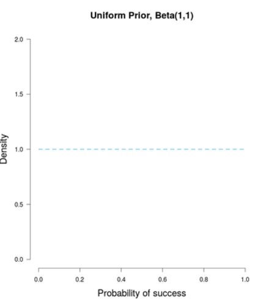
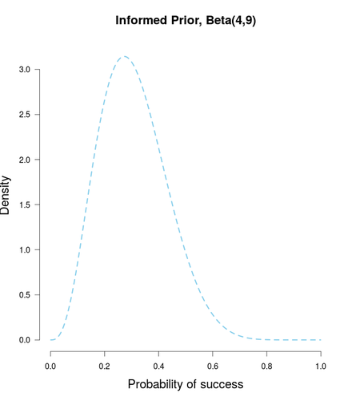
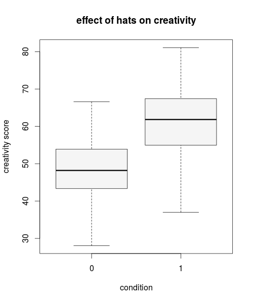
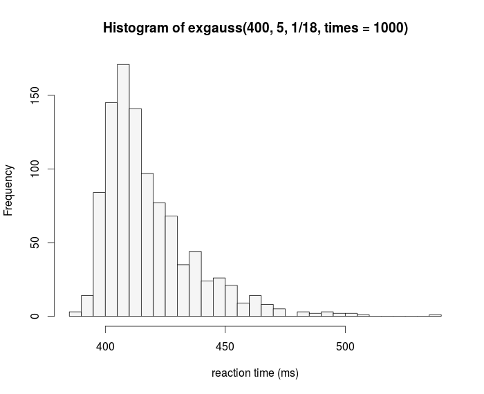
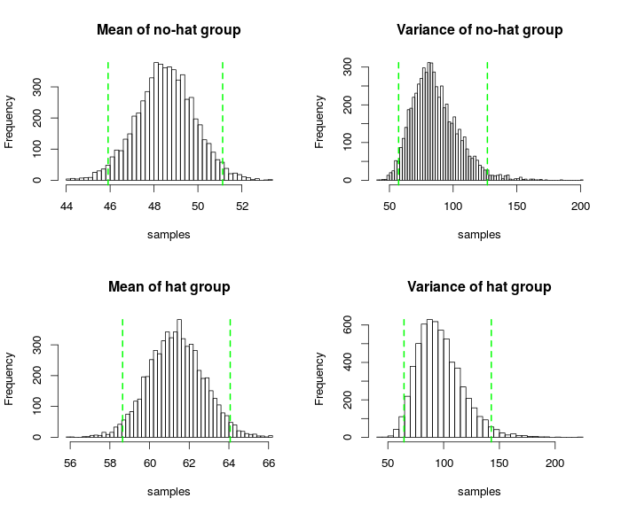
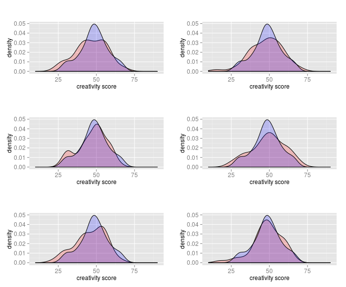
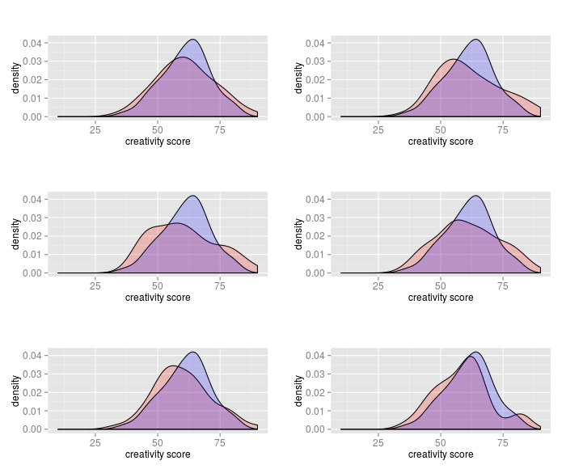
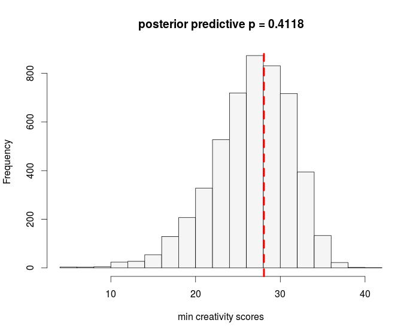

## Note
- please install http://jasp-stats.org
- and Mplus if you like (on the stick)
- if you're a hacker, git clone the repo **dostodabsi/bayes_workshop**
- otherwise wait for the USB-stick; all materials are on there

<div class="notes">

STRUCTURE:
  1. Peter (10 mins): THIS IS AN UPWARMER! Introduction based on Statistics Crowdsourcing-paper
    Introducing terms "model", "parameter", "parameter estimation", "hypothesis testing" to lay the ground for Fabian; activate peoples' curiosity and prior knowledge related to these terms so it can be changed in the workshop. In the end of this introductory part, Peter gives a very concise overview of the three parts ofthe workshop
  2. Fabian (20 mins): "Statistics - Dealing With Uncertainty"
  3. Peter & Fabian (40 minutes): MAIN PART
    - 5 min Data example (Creativity & Intelligence -> thrilling topic! :D) -> p-value interpretation
    - 5 min Frequentist statistics
    - 5 min p-value bashing
    - 5 min Geoff Cumming (transition to Likelihood)
    - 10 min Likelihood [Fabian]
    - 5 min Bayes Theorem [Peter]
    - 10-20 min: Explain more in depth and clearly the terms prior, likelihood, posterior, credibility interval, BayesFactor; end with structure of a Bayesian analysis which is the transition to the practical part
  4. Pactical part (40 minutes)
    JASP: 30 minutes
    Mplus: 10 minutes
  5. (super-short so won't be boring) Wrap up & closing, pot. mention some other software and books, pot. questions

</div>


# Statistics

## Statistics

<div class="notes">

  Statistics has something very critical in common with all the rest of science.
  There is no truth.
  The things that we believe nowadays to be flawless can be replaced by something totally different tomorrow.
  There is no correct way to do things in statistics.
  If you give dozens of statisticans around the world the same dataset with the research question,
  they will all do completely different things.

</div>

> - There is no truth

> - No correct way

> - Everyone does different things

## Statistics

<div class="notes">

  Why do I tell you this?
  Do I want to tell you that statistics is nonsense?
  Everyone does different things in statistics and there is no correct way, so why use statistics?

</div>

> - So what?

<div align="center">

</div>

## Statistics

<div class="notes">

  Because is can be useful.
  The more wisely we choose our statistical methods, the more reliable and precise they will be in telling us about relations in the world and about the adequacy of our hypothesis.

</div>

## Statistics

<div class="notes">
  
  Let's look at the study that I told you about.

</div>

Silberzahn, R., et al. (2015). Crowdsourcing data analysis: Do soccer referees give more red cards
to dark skin toned players? Center for Open Science, https://osf.io/j5v8f/

> - 29 teams of statisticans around the world

> - Same data set, same question

> - What do they do?

## Statistics

<div class="notes">
  This actually happened.
  Last year, and many well known statisticans that you might know from Psychology participated.
  Raphael Silberzahn, Brian Nosek and two others people invited people to join their "statistics crowdsourcing" project.
  They gave 71 researchers in 29 teams the same dataset to try to answer the same question.
  The question was: Do soccer referees give more red cards to dark skin toned players?
  
</div>

<div align="center">

</div>

## Statistics

- What would you do?

<div align="center">

</div>

## Statistics

- What do they do?

<div align="center">

</div>

## Statistics

<div class="notes">

  What did the 27 teams find?
  Their results differed what most of you probably would rate very strongly.
  20 found a significant positive efect of skin tone on red card.
  However, as you can see here, the effect size estimates differed strongly, and only those where the effect size estimate intervals start above 0 could be said to have found an effect. The odds ratios that the researchers estimated were between 0.89 and 2.89. Hence, while some teams estimated that dark skin tone players are a bit less likely to receive red cards, some estimated that they are three times as likely.

</div>

- What do they find?

<div align="center">

</div>

## Statistics

<div class="notes">

  Why do I show you this example?
  Do I want to tell you that statistics is nonsense?
  Everyone does different things in statistics and there is no correct way, so why use statistics?

</div>

> - So what?

- This is part of a crisis in Psychology

> - Can be useful

## Statistics

<div class="notes">

  As we have seen, there was considerable variation in the statistical models that the researchers used.
  Some used linear models, some used logit models, some used nested models, some fixed effects models.
  Our focus today is not on statistical models.
  These researchers did not only use different models, they also obtained different results.
  What is the second ingredient for obtaining results, besides a statistical model?
  [ASK AUDIENCE]
  Yes, perfect. You have to estimate the model parameters!
  What do we obtain when we "estimate a model"?
  Exactly; we obtain estimates for the parameters of our model, for example how strong the connection between skin tone and probability of a red card is. We also obtain standard errors, and we obtain p-values.
  What should we use the p-values for? What do they tell us?
  Yes, we need them to tell whether a parameter is significant. For example, we want to know whether there is an association between skin tone and red cards. To answer this question, we can use p-values.
  To summarize, statistical modelling is combined of two ingredients. First, we have a model, which should represent our assumptions, for example our theory and resulting hypotheses. Our model depicts the relations between different things that we assume and want to test. Second, we have the estimation. Each of our assumptions is depicted as a parameter in the model. If we want to test an assumption, we have to estimate how large the parameter is, and whether it actually makes sense, so, if our hypothesis underlying the parameter is true.
  The model estimation is what we care about today. Statistical models are the same ones that you are used to, for example the t-test, the ANOVA or analysis of variance, regression and multiple regression, and so on.
  However, the question that we are concerned with today is the estimation:
  You choose your model based on theoretical assumptions related to your research question.
  But which assumptions underlie the parameter estimation? Do we just choose an estimation technique that gives us the best results, whatever that is?
  Most teams in the red cards paper used classical methods for parameter estimation and hypothesis testing. You might have heard of some of these , for example least squares estimation, and maximum likelihood estimation.
  However, five of the teams used so-called bayesian estimation.
  This is what we are concerned with today. It differs essentially from the classical estimation techniques. In many cases it yields results for parameter estimates that are very similar to those based on classical methods, but not always. Most importantly, bayesian estimation has very different theoretical assumptions than classical estimation. The result is that the parameter estimates are often "the same" but the conclusions that you can draw from your estimates and hypotesis tests are totally different. Therefore, today we talk about Bayesian Statistics. Does this sound intriguing to you? This was just a preview.
  
</div>

## Bayesian Statistics
  
<div class="notes">

  We have four main parts today.
  First, Fabian will discuss the question "What is statistics?" He will approach it in a way that lays the foundation for our understanding of all the rest.
  Then, we will tell you about the classical way of estimation and hypothesis testing, which is called frequentist statistics, and this well lead over to Bayesian estimation and hypothesis testing, in short Bayesian statistics, which is much nicer.
  Then, we will practice Bayesian statistics in a super nice free software [JASP]. I will also give you an overview how you can estimate all the models that you know in the Bayesian way [Mplus].
  [In the fourth part, we will summarize and are looking forward to your questions.]
  
</div>


## Outline

- A few remarks on the "replication crisis" in psychology

- **Statistics: The Status Quo**
    * 1.1 A Bird's Eye View
    * 1.2 An Example
    * 1.3 Notes on the history of statistics

- **Problems with current statistical practices**
    * 2.1 Null Hypothesis Significance Testing
    * 2.2 Confidence intervals and statistical power
    * 2.3 Aggregating Data

## Outline

- **The principled Bayesian**
    * 3.1 Probability and Bayes' rule
    * 3.2 Binomial example (coin tosses -- what else?)
    * 3.4 Model comparison using Bayes factor

- **The practical Bayesian**
    * 4.1 Creativity example
    * 4.2 Monte Carlo methods
    * 4.3 Markov chain Monte Carlo methods
    * 4.4 Model adequacy and posterior predictive checks

## Outline

- **Software for Bayesian data analysis**
    * 4.1 various data sets analysed in JASP
    * 4.2 Mplus (Structure Equation Modeling)

- **Hands-on session**
- **Discussion**

# The principled Bayesian

## Probability: Sum rule
- an urn holds $N$ balls: $R$ red, $B$ blue, the rest white
- uncertainty of drawing a red ball: $R / N$
- uncertainty of drawing a coloured ball: $R / N + B / N$

## Probability: Product rule
- an urn holds $N$ balls: $R$ red, $1 - R$ white, $S$ spotted, $1 - S$ plain
- given that, there are $T$ spotted *and* red balls
- uncertainty of drawing such a ball is: $T / N$
- $\frac{T}{N} = \frac{R}{N} \times \frac{T}{R} = \frac{S}{N} \times \frac{T}{S}$
- what does this mean?

## Probability: Product rule {.small}
+---------------+---------------+--------------------+--------------------+
|               |    RED        |      WHITE         |                    |
+===============+===============+====================+====================+
| SPOTTED       |     T         |                    |         S          |
+---------------+---------------+--------------------+--------------------+
| PLAIN         |               |                    |       1 - S        |
+---------------+---------------+--------------------+--------------------+
|               |     R         |      1 - R         |         N          |
+---------------+---------------+--------------------+--------------------+

## Probability: Product rule {.small}
- we want to find $P(\text{spotted}, \text{red}) = T / N$
$$
\begin{align*}
P(\text{spotted}, \text{red}) &= P(\text{spotted}|\text{red})P(\text{red}) \\[1ex]
\frac{T}{N} &= \frac{T}{R} \times \frac{R}{N} \\[3ex]
P(\text{spotted}, \text{red}) &= P(\text{red}|\text{spotted})P(\text{spotted}) \\[1ex]
\frac{T}{N} &= \frac{T}{S} \times \frac{S}{N}
\end{align*}
$$


## Implication of Sum rule
- $P(\text{red}) = P(\text{red}|\text{spotted}) + P(\text{red}|\text{plain})$
- $P(\text{red})$ is called a marginal probability
- by summing up all the conditional probabilities, we arrive at the marginal
- this will be important when we talk about the marginal likelihood in model comparison


## Summing up
- we have derived the intuitive product and sum rule of probability
- this is the core of Bayesian statistics -- I'm not kidding!
- the rest is just being smart about how to apply them


## Derivation of Bayes' rule
- it's just conditional probability:
$$
\begin{align}
P(\text{spotted}, \text{red}) &= P(\text{spotted}|\text{red})P(\text{red}) \\[1ex]
P(\text{spotted}, \text{red}) &= P(\text{red}|\text{spotted})P(\text{spotted}) \\[1ex]
\end{align}
$$

- which yields Bayes' Rule:

$$
\begin{align*}
P(\text{spotted}|\text{red})P(\text{red}) &= P(\text{red}|\text{spotted})P(\text{spotted}) \\[1ex]
P(\text{spotted}|\text{red}) &= \frac{P(\text{spotted}) \times P(\text{red}|\text{spotted})}{P(\text{red})}
\end{align*}
$$

## Bayes' rule: intuition
- what is the probability of my hypothesis, p($H$), given the data, $\textbf{y}$, I have collected?
$$
p(H|\textbf{y}) = \frac{p(H)p(\textbf{y}|H)}{p(\textbf{y})}
$$


## Some terminology
- with parameter vector $\theta$ and data $\textbf{y}$:
$$
\begin{align*}
p(\theta|\textbf{y}) &= \frac{p(\textbf{y}|\theta)p(\theta)}{p(\textbf{y})} \\[1ex]
\text{posterior} &= \frac{\text{likelihood} \times \text{prior}}{\text{marginal likelihood}} \\[2ex]
\text{posterior} &\sim \text{likelihood} \times \text{prior}
\end{align*}
$$

## Binomial example
- first we quantify our beliefs with a prior distribution, $p(\theta)$
- we specify our statistical model, $p(\textbf{y}|\theta)$
- then we just plug in Bayes' rule, dropping the marginal likelihood:
$$
p(\theta|\textbf{y}) \sim p(\textbf{y}|\theta)p(\theta)
$$

## Binomial example: prior I


## Binomial example: prior II


## Binomial example: prior III



## Conjugacy
- a conjugate prior is a prior that when combined with the likelihood yields a posterior that is of the same
distributional family as the prior
- the parameters of conjugate priors can be interpreted as prior data

$$
\begin{align*}
\mathcal{N}(\mu_0, \sigma_0^2) &\text{ is conjugate for } \mu \text{ in } \mathcal{N}(\mu, \sigma^2) \\
\mathcal{IG}(\alpha, \beta) &\text{ is conjugate for } \sigma^2 \text{ in } \mathcal{N}(\mu, \sigma^2) \\
\mathcal{Beta}(\alpha, \beta) &\text{ is conjugate to } \mathcal{Bin}(n, p) \\
\mathcal{Beta}(\alpha, \beta) &\text{ is conjugate to } \mathcal{NegBin}(n, p) \\
\mathcal{Dir}(\omega) &\text{ is conjugate to } \mathcal{Mult}(\theta) \\
\mathcal{G}(\alpha, \beta) &\text{ is conjugate to } \mathcal{Pois}(n, \lambda) \\
\mathcal{G}(\alpha, \beta) &\text{ is conjugate to } \mathcal{Exp}(n, \lambda) \\
\mathcal{Pareto}(\alpha, \beta) &\text{ is conjugate to } \mathcal{Unif}(a, b) \\
\end{align*}
$$

## Binomial example: likelihood
- instead of $p(\textbf{y}|\theta)$ we write $\mathcal{L}(\theta; \textbf{y})$
- for the binomial case, we use:
$$
\mathcal{L}(\theta; k, N) = \theta^k \times (1 - \theta)^{N - k}
$$

where $k$ is the number of successes and $N$ the number of data points

## Binomial example: likelihood
- likelihoods are relative, and are *not* probabilities!
- they indicate how likely the data is, given certain parameter values
- assume $k = 2$, $N = 4$:

$$
\begin{align*}
\mathcal{L}(\theta = .5; k = 2, N = 4) = .5^2 \times (1 - .5)^{4 - 2} = .375 \\[1ex]
\mathcal{L}(\theta = .9; k = 2, N = 4) = .9^2 \times (1 - .9)^{4 - 2} = .049
\end{align*}
$$

## Binomial example: likelihood
- likelihoods quantify statistical evidence
- $\theta = .5$ is $.375 / .049 = 7.65$ times more likely than $\theta = .9$ 
- using this method, we can only compare *point* hypotheses
- later we will see how Bayes factors relax this restriction


## Binomial example: posterior
- the posterior is simply a combination of the prior and the likelihood
- in binomial settings, we a have simple updating rule:
$$
\begin{align*}
p(\theta) &\sim \mathcal{Beta}(a, b) \\[1ex]
p(\theta|\textbf{y}) &\sim \mathcal{Beta}(a + k, b + N - k)
\end{align*}
$$


## Binomial example: shiny
- Visualisations from a great blog post by [Alexander Etz](http://alexanderetz.com/2015/08/09/understanding-bayes-visualization-of-bf/)
- explain:
    * Bayesian updating
    * Cromwell's Rule
    * flat priors and maximum likelihood


## Interim conclusion II
- Bayesian statistics follows from probability
- it thus inherits favourable properties that classical statistics lacks
- **rationality**: if one violates Bayesian reasoning, one can systematically loose money
- **coherence**: the order of updating one's belief does not matter
- **intuitive**: it allows us to say how probable our hypothesis is after the experiment


## Model comparison
- how strongly can we believe in our hypothesis, given the collected data?
- that is, we want $p(H|\textbf{y})$
- a hypothesis can be instantiated in a model
- $H_0: \delta = 0$ corresponds to a model where the parameter $\delta$ is fixed to 0
- $H_1: \delta \neq 0$ corresponds to a model where the parameter $\delta$ is free to vary

## Bayes factor: Derivation
- assume two models, $M_0$ and $M_1$, that instantiate $H_0$ and $H_1$, respectively
- after we have collected data, $p(\textbf{y})$, which model should we prefer?
- the probability of each model is computed using Bayes' rule:

$$
\begin{align}
p(M_0|\textbf{y}) &= \frac{p(\textbf{y}|M_0)p(M_0)}{p(\textbf{y})} \\[1ex]
p(M_1|\textbf{y}) &= \frac{p(\textbf{y}|M_1)p(M_1)}{p(\textbf{y})}
\end{align}
$$

## Bayes factor: Derivation

$$
\begin{align}
\frac{p(M_0|\textbf{y})}{p(M_1|\textbf{y})} &= \frac{\frac{p(\textbf{y}|M_0)p(M_0)}{p(\textbf{y})}} {\frac{p(\textbf{y}|M_1)p(M_1)}{p(\textbf{y})}} \\[2ex]
\frac{p(M_0|\textbf{y})}{p(M_1|\textbf{y})} &= \frac{p(M_0)}{p(M_1)}\frac{p(\textbf{y}|M_0)}{p(\textbf{y}|M_1)} \\[2ex]
\text{posterior odds} &= \text{prior odds} \times \text{Bayes factor}
\end{align}
$$

## Bayes factor: Intuition
- the Bayes factor is an updating factor
- it tells us how to update our prior beliefs about the hypotheses, given the data
- note that there are two priors: over models $M$, and over parameters $\theta$
- the term $p(\textbf{y}|M_0)$ is the marginal likelihood under model $M_0$
- in other words, it is the probability of the data under model $M_0$
- it quantifies how well this model predicts the data

## Bayes factor: Marginal likelihood
- in parameter estimation, we have avoided this term
- now that we compare models, we cannot do so!
- often it is a high-dimensional integral, which is difficult to compute
- for $M_0$, it is:
$$
p(\textbf{y}|M_0) = \int p(\textbf{y}|\theta, M_0)p(\theta|M_0)\mathrm{d}\theta
$$

- this simply follows from the sum rule discussed before
- it is a weighted average of the likelihood with respect to the prior


## Bayes factor: Interpretation
- the Bayes factor is a generalization of the likelihood ratio
- recall before, we compared $H_0: \theta = .5$ against $H_1: \theta = .9$
- Bayes factors let us test composite hypothesis, like $H_0: \theta \neq 0$
- for this, we have to specify a prior distribution over $\theta$

## Bayes factor: shiny demo
- explain:
    * Bayes factor interpretation
    * Savage-Dickey density ratio
    * parameter estimation versus hypothesis testing
    * Bayes factor always interpretable -- regardless of sample size

## Bayes factor: Savage-Dickey density ratio
- a neat mathematical trick to avoid computing the marginal likelihood:

$$
BF_{01} = \frac{p(\delta = 0|H_1, \textbf{y})}{p(\delta = 0|H_1)}
$$


## Bayes factor: Jeffreys-Lindley's paradox
- uninformative priors should not be used
- they lead to unbounded support for $H_0$
- BayesFactor, JASP use default priors


## Interim conclusion III
- Bayes factor quantifies statistical evidence
- allows us to state evidence for $H_0$
- no issue with sequential testing
- does not depend on the sample size
- if the data are uninformative, the Bayes factor will tell you exactly that


## Principled conclusion
- again, the sum and product rule are the core of Bayesian statistics
- "Bayesian" is somewhat of a misnomer
- everything follows from the sum and product rule
- the rest is just being smart on how to apply them


# The practical Bayesian
## Setup
- do hats boost creativity?

```{r}
set.seed(1774)

hat <- rnorm(50, 60, 10)
nohat <- rnorm(50, 50, 10)
dat <- data.frame(score = c(nohat, hat), hat = rep(0:1, each = 50))
```

## Setup


## Bayesian approach
- specify a joint distribution over parameters and data, $p(\textbf{y}, \mu, \sigma^2)$, thus:

$$
\begin{align*}
p(\mu, \sigma^2|\textbf{y}) &= \frac{p(\textbf{y}|\mu, \sigma^2)p(\mu, \sigma^2)}{p(\textbf{y})} \\[1ex]
p(\mu, \sigma^2|\textbf{y}) &\sim p(\textbf{y}|\mu, \sigma^2)p(\mu, \sigma^2)
\end{align*}
$$


## Likelihood -- our statistical model
- we assume that the data are normally distributed; for a single datum, thus:
$$
\begin{equation*}
\mathcal{L}(\mu, \sigma^2; y) = \frac{1}{\sqrt{2\pi\sigma^2}} \exp(\frac{-(y - \mu)^2}{2\sigma^2})
\end{equation*}
$$

- assuming *exchangeability*, we can write:

$$
\begin{equation*}
\mathcal{L}(\mu, \sigma^2; \textbf{y}) = \prod_{i = 1}^n \frac{1}{\sqrt{2\pi\sigma^2}} \exp(\frac{-(y_i - \mu)^2}{2\sigma^2})
\end{equation*}
$$


## Likelihood -- what is it?
- likelihood denotes the probability of the data, given certain fixed parameter values

$$
\begin{align*}
\mathcal{L}(\mu = 40, \theta = 15; y = 50) &= .0213 \\
\mathcal{L}(\mu = 50, \theta = 15; y = 50) &= .0266
\end{align*}
$$


## Prior
- In Bayesian inference, we need to formalize our belief before seeing the data
- doing this over $\mu$ and $\sigma^2$ simultanously is difficult
- thus we make the simplifying assumption that the priors are independent
- $p(\mu, \sigma^2) = p(\mu)p(\sigma^2)$
- because we are simply estimating parameters, we do not need to specify informative priors

## Prior specification

$$
\begin{align*}
p(\mu) &\sim \mathcal{N}(\mu_0, \omega_0^2) \\
p(\sigma^2) &\sim \mathcal{IG}(v_0, \frac{v_0 \sigma_0^2}{2})
\end{align*}
$$

- we specify a normal over $\mu$, and an inverse gamma over $\sigma^2$
- this prior specification is *semi-conjugate*:

$$
\begin{align*}
p(\mu|\textbf{y}, \sigma^2) &\sim \mathcal{N}(\mu, \omega^2) \\
p(\sigma^2|\textbf{y}, \mu) &\sim \mathcal{IG}(v_1, S)
\end{align*}
$$

where $\omega^2$ depends on $\sigma^2$ and $S$ depends on $\mu$

## Posterior distribution
- we don't get marginal posterior distributions, $p(\mu|\textbf{y})$ and $p(\sigma^2|\textbf{y})$ when using independent priors
- but it is those that we want for drawing inferences!
- use **Markov chain Monte Carlo** methods (in this case: *Gibbs Sampling*)
- let's first discuss Monte Carlo on a simple example

## distribution of reaction times
- reaction times are not (log)normally distributed
- instead, an Ex-Gaussian distribution fits best
- it is the sum of an exponential and a Gaussian
$$
x | \eta \sim \mathcal{N}(\mu + \eta, \sigma^2) \\[1ex]
\eta \sim \mathcal{Exp}(\nu)
$$

## distribution of reaction times
- but we do not want $x | \eta$ (conditional probability)
- we want $x$ (marginal probability)
- analytically, one would apply the sum rule and "integrate out" $\nu$
- however, that is not tractable -- so instead, we use Monte Carlo methods
- this are computer based methods to solve hard problems

## Monte Carlo principle
- **anything we want to know about a random variable $\theta$ can be learned by sampling
many times from f($\theta$), the density of $\theta$**
- in R, we can sample randomly from different probability distributions
- for example, "rnorm", "rbeta", "rgamma", "rexp"

## Monte Carlo integration
- we sample from $\eta$ using "rexp" and use this value for $x | \eta$ in "rnorm"

## Monte Carlo integration
```{r}
exgauss <- function(mu, sigma, rate, times = 1000) {
  res <- rep(NA, times)
  
  for (i in 1:times) {
    nu <- rexp(1, rate)
    res[i] <- rnorm(1, mu + nu, sigma)
  }
  
  res
}
```

## Monte Carlo integration


## Monte Carlo integration
- is quite a neat technique!
- let's generalize it to Gibbs Sampling
- in our creativity example, both distributions are conditional on each other
- in a sense, now we have to do monte carlo integration for both of them
- we do this iteratively, in each step drawing from both distributions, conditional on the other value

## Gibbs Sampling
```{r}
gibbs <- function(mu0, w0, v0, sigma0, y, n.iter = 8000, burnin = n.iter / 4) {
  n <- length(y)
  
  v1 <- v0 + n
  mu_post <- rep(mean(y), n.iter)
  var_post <- rep(var(y), n.iter)
  
  for (i in 2:n.iter) {
    mu <- mu_post[i-1]
    sigma2 <- var_post[i-1]
    w1 <- 1 / (n / sigma2 + 1 / w0^2) # condition on current variance
    mu1 <- ((n / sigma2) * mean(y) + (1 / w0^2) * mu0) / (n / sigma2 + 1 / w0^2)
    mu_post[i] <- rnorm(1, mu1, sqrt(w1))
    S <- sum((y - mu)^2) # condition on current mean
    var_post[i] <- 1 / rgamma(1, v1 / 2, S / 2)
  }
  cbind(mu_post, var_post)[-(1:burnin), ]
}
```

## Gibbs Sampling
- why is this called a Markov chain Monte Carlo technique?
- Markov chain because the values are dependent on each other
- we don't want this, so we "burn-in" the first few samples
- we can also do thinning -- only keep every second draw
- it is important to check convergence

## Posterior distributions
- for parameter estimation we can specify uninformative priors:
$$
\begin{align}
\omega_0^2 = 1000 \\
\nu_0 = .0001 \\
\sigma_0^2 = .0001
\end{align}
$$

## Posterior distributions


## Is our model adequate?
- the Bayes factor is relative
- just because a model is favoured very strongly against another, doesn't make it any good
- we have to check for the model's adequacy -- against the real world
- in a Bayesian setting, this is done using *posterior predictive checks*
- we simulate data from our model and check if it gravely misrepresents the observed data

## Posterior predictive checks
- more formally, we compute:
$$
p(\textbf{y}_{rep}|\textbf{y}) = \int p(\textbf{y}_{rep},|\theta)p(\theta|\textbf{y})\mathrm{d}\theta
$$
- we can then use plots and visualisations to assess possible discrepancies

## Posterior predictive checks: no-hat condition


## Posterior predictive checks: hat condition


## Posterior predictive checks
- alright -- but we might want to quantify the discrepancy
- and test whether there is *significant* deviation
- yes, I just used the word *significant*
- for each posterior predictive sample, we can apply a function *T* which returns some
value of interest (test statistic)
- this yields a distribution of those values
- we can then apply the function to our observed data, and see if the outcome is extreme
w.r.t. to the distribution

## Posterior predictive *p* values
- formally, we compute:
$$
p = p(T(y_{rep}, \theta)) \geq T(\textbf{y}, \theta|\textbf{y}))
$$

## Posterior predictive *p* values
- for the hat condition it looks like there might be outliers
- a simple (naive?) approach would be to use *min* as the test statistic

## Posterior predictive *p* values


## Effect size


## Effect size
- in this case, it's obvious that hats make a substantial difference
- these data pass the *interocular traumatic test*
- they are so obvious -- it hits you right between the eyes!
- in the real world, however, things are rarely that clear:
- "... the enthusiast's interocular trauma may be the skeptic's random error. A little arithmetic to verify the extent of the trauma can yield great peace of mind for little cost." [@edwards1963bayesian, p. 217]

# JASP
## JASP
- developed by a research group around Jonathon Love in Amsterdam
- provides a free, open-source, modern alternative to SPSS
- does frequentist as well as Bayesian inference
- computes Bayes factors -- providing us with a great peace of mind

## Motivating example
- in replication research, being able to support the null hypothesis is crucial
- Topolski and Sparenberk (2012) found that counter clockwise movements lead to an orientation towards the future and novelty
- Wagenmakers et al. (2015) directly replicated this research

## turning the hands of time


## Demo

## kitchen rolls wrap up
- you can find the pre-registration form of this research [here](https://osf.io/p3isc/), see the section **sampling plan**
- they failed to replicate the effect; the data were about 10 times more likely under $H_0$ then under $H_1$
- descriptives point in the other direction as originally observed (higher openness when counter clock wise)

## bathing habits
- lonely people compensate the lack of social warmth by taking warmer showers and baths [@bargh2012bath]
- ummmmmmm, really?
- @donnellan2014association tried to replicate this in 9 experiments with over 3000 participants
- @wagenmakers2015absence re-analysed the data using Bayesian inference

## Demo

## bathing wrap up
- *p* values are uniformly distributed under $H_0$
- must be Bayesian to quantify support for $H_0$ 
- because there is a difference between $p > 0.05$, the data are uninformative
- and $p > 0.05$, data are informative and support $H_0$
- classical statistics **does not make** this distinction

## References
