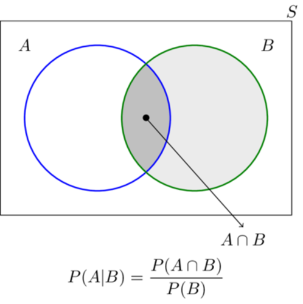
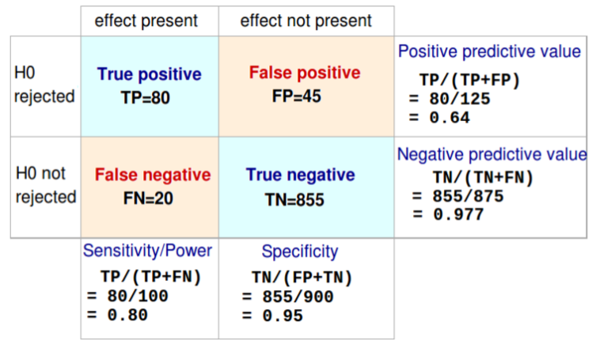

## Outline <!-- Fabian -->

- A few remarks on the "replication crisis" in psychology

- **Statistics: The Status Quo**
    * 1.1 A Bird's Eye View
    * 1.2 An Example
    * 1.3 Notes on the history of statistics

- **Problems with current statistical practices**
    * 2.1 Null Hypothesis Significance Testing
    * 2.2 Confidence intervals and statistical power
    * 2.3 Aggregating Data

## Outline

- **The principled Bayesian**
    * 3.1 Probability and Bayes' rule
    * 3.2 Why most published research findings are false
    * 3.3 Binomial example (coin tosses -- what else?)
    * 3.4 Model comparison using Bayes factor

- **The practical Bayesian**
    * 4.1 Creativity and Gibbs sampling
    * 4.2 Model adequacy and posterior predictive checks
    * 4.3 JAGS and checking convergence

## Outline

- **Some examples of Bayesian inference**
    * 4.1 Various data sets analyzed JASP
    * 4.2 Structural Equation Modeling

- **Assignments**


## Note
- please install http://jasp-stats.org
- if you're a hacker, git clone the repo **dostodabsi/bayes_workshop**
- otherwise wait for the USB-stick; all materials are on there

# The principled Bayesian

## Probability: Sum
- an urn holds $N$ balls: $R$ red, $B$ blue, the rest white
- uncertainty of drawing a red ball: $R / N$
- uncertainty of drawing a coloured ball: $R / N + B / N$

## Probability: Product
- an urn holds $N$ balls: $R$ red, $1 - R$ white, $S$ spotted, $1 - S$ plain
- given that, there are $T$ balls that are spotted *and* red
- uncertainty of drawing such a ball is: $T / N$
- $\frac{T}{N} = \frac{R}{N} \times \frac{T}{R} = \frac{S}{N} \times \frac{T}{S}$

## Probability
- more formally, we end up with:
$$
\begin{align}
P(A \text{ or } B) &= P(A) + P(B) - P(A \text{ and } B) \\[1ex]
P(A \text{ and } B) &= P(A) \times P(A|B)
\end{align}
$$


## Venn diagram (http://goo.gl/1B9F3V)



## Derivation of Bayes' rule
- it's just conditional probability:
$$
\begin{align}
P(A \text{ and } B) &= P(A) \times P(A|B) \\[1ex]
P(A \text{ and } B) &= P(B) \times P(B|A)
\end{align}
$$

- which yields Bayes' Rule:

$$
\begin{align*}
P(A) \times P(A|B) &= P(B) \times P(B|A) \\[1ex]
P(A|B) &= \frac{P(B) \times P(B|A)}{P(A)}
\end{align*}
$$

## Why most published research findings are false
- Ioannidis (2005) argued that most published research findings are false
- common misconception:
    * $\alpha = .05$, thus number of false positives is only 5%
    * problem: we compute $p(\textbf{y}|H)$ and not $p(H|\textbf{y})$
    * ignores relevant prior information (the base rate of true hypotheses)

## Why most published research findings are false


## Why most published research findings are false
$$
\begin{align*}
PPV &= \frac{TP}{(TP + FP)} \\[1ex]
PPV &= \frac{TP(TP + FN) / (TP + FN)}{TP (TP + FN) / (TP + FN) + FP}
\end{align*}
$$

- recall that:
    * $prior = TP + FN$
    * $power = TP / (TP + FN)$
    
- therefore:
$$
PPV = \frac{power \times prior}{power \times prior + \alpha}
$$

## Interim conclusion I
- to make probability statement about a hypothesis -- you need a prior
- people often forget the prior (base rate), which makes them overconfident
- most published research is indeed likely to be false, due to:
    * publication bias
    * low statistical power [@cohen1962statistical; @button2013power]
    * statistical analysis that is contingent on data [@simmons2011false; @gelman2013garden]


## Some terminology
- with parameter vector $\theta$ and data $\textbf{y}$:
$$
\begin{align*}
p(\theta|\textbf{y}) &= \frac{p(\textbf{y}|\theta)p(\theta)}{\textbf{y}} \\[1ex]
\text{posterior} &= \frac{\text{likelihood} \times \text{prior}}{\text{marginal likelihood}} \\[2ex]
\text{posterior} &\sim \text{likelihood} \times \text{prior}
\end{align*}
$$

## Binomial example
- so how do we update our beliefs?
- first we quantify our beliefs with a prior distribution, $p(\theta)$
- we specify our statistical model, $p(\textbf{y}|\theta)$
- then we just plug in Bayes' rule, dropping the marginal likelihood:
$$
p(\theta|\textbf{y}) \sim p(\textbf{y}|\theta)p(\theta)
$$

## Binomial example: prior I


## Binomial example: prior II


## Binomial example: prior III


## Conjugacy
- a conjugate prior is a prior that when combined with the likelihood yields a posterior that is of the same
distributional family as the prior
- the parameters of conjugate priors can be interpreted as prior data

$$
\begin{align*}
\mathcal{N}(\mu_0, \sigma_0^2) &\text{ is conjugate for } \mu \text{ in } \mathcal{N}(\mu, \sigma^2) \\
\mathcal{IG}(\alpha, \beta) &\text{ is conjugate for } \sigma^2 \text{ in } \mathcal{N}(\mu, \sigma^2) \\
\mathcal{Beta}(\alpha, \beta) &\text{ is conjugate to } \mathcal{Bin}(n, p) \\
\mathcal{Beta}(\alpha, \beta) &\text{ is conjugate to } \mathcal{NegBin}(n, p) \\
\mathcal{Dir}(\omega) &\text{ is conjugate to } \mathcal{Mult}(\theta) \\
\mathcal{G}(\alpha, \beta) &\text{ is conjugate to } \mathcal{Pois}(n, \lambda) \\
\mathcal{G}(\alpha, \beta) &\text{ is conjugate to } \mathcal{Exp}(n, \lambda) \\
\mathcal{Pareto}(\alpha, \beta) &\text{ is conjugate to } \mathcal{Unif}(a, b) \\
\end{align*}
$$

## Binomial example: likelihood
- instead of $p(\textbf{y}|\theta)$ we write $\mathcal{L}(\theta; \textbf{y})$
- for the binomial case, we use:
$$
\mathcal{L}(\theta; k, N) = \theta^k \times (1 - \theta)^{N - k}
$$

where $k$ is the number of successes and $N$ the number of data points

## Binomial example: likelihood
- likelihoods are relative, and are *not* probabilities!
- they indicate how likely the data is, given certain parameter values
- assume $k = 2$, $N = 4$:

$$
\begin{align*}
\mathcal{L}(\theta = .5; k = 2, N = 4) = .5^2 \times (1 - .5)^{4 - 2} = .375 \\[1ex]
\mathcal{L}(\theta = .9; k = 2, N = 4) = .9^2 \times (1 - .9)^{4 - 2} = .049
\end{align*}
$$

## Binomial example: likelihood
- likelihoods quantify statistical evidence
- $\theta = .5$ is $.375 / .049 = 7.65$ times more likely than $\theta = .9$ 
- note that we have to be very certain about our alternative
- later we will see how Bayes factors solve this problem


## Binomial example: posterior
- the posterior is simply a combination of the prior and the likelihood
- in binomial settings, we a simple updating rule:
$$
\begin{align*}
p(\theta) &\sim \mathcal{Beta}(a, b) \\[1ex]
p(\theta|\textbf{y}) &\sim \mathcal{Beta}(a + k, b + N - k)
\end{align*}
$$


## Binomial example: shiny
- demo the shiny updating app
- give appropriate credit to Alexander Etz (also for the pictures!)


## Interim conclusion II
- Bayesian statistics follows from probability
- it thus inherits favourable properties that classical statistics lacks
- **rationality**: if one violates Bayesian reasoning, one can systematically loose money
- **coherence**: the order of updating one's belief does not matter
- **intuitive**: it allows us to say how probable our hypothesis is after the experiment


## Model comparison
- how strongly can we believe in our hypothesis, given the collected data?
- that is, we want $p(H|\textbf{y})$
- a hypothesis can be instantiated in a model
- $H_0: \delta = 0$ corresponds to a model where the parameter $\delta$ is fixed to 0
- $H_1: \delta \neq 0$ corresponds to a model where the parameter $\delta$ is free to vary

## Bayes factor: derivation
- assume two models, $M_0$ and $M_1$, that instantiate $H_0$ and $H_1$, respectively
- after we have collected data, $p(\textbf{y})$, which model should we prefer?
- the probability of each model is computed using Bayes' rule:

$$
\begin{align}
p(M_0|\textbf{y}) &= \frac{p(\textbf{y}|M_0)p(M_0)}{p(\textbf{y})} \\[1ex]
p(M_1|\textbf{y}) &= \frac{p(\textbf{y}|M_1)p(M_1)}{p(\textbf{y})}
\end{align}
$$

## Bayes factor: Derivation

$$
\begin{align}
\frac{p(M_0|\textbf{y})}{p(M_1|\textbf{y})} &= \frac{\frac{p(\textbf{y}|M_0)p(M_0)}{p(\textbf{y})}} {\frac{p(\textbf{y}|M_1)p(M_1)}{p(\textbf{y})}} \\[2ex]
\frac{p(M_0|\textbf{y})}{p(M_1|\textbf{y})} &= \frac{p(M_0)}{p(M_1)}\frac{p(\textbf{y}|M_0)}{p(\textbf{y}|M_1)} \\[2ex]
\text{posterior odds} &= \text{prior odds} \times \text{Bayes factor}
\end{align}
$$

## Bayes factor: Intuition
- the Bayes factor is an updating factor
- it tells us how to update our prior beliefs about the hypotheses, given the data
- note that there are two priors: over models $M$, and over parameters $\theta$
- the term $p(\textbf{y}|M_0)$ is the marginal likelihood under model $M_0$
- in other words, it is the probability of the data under model $M_0$
- it quantifies how well this model predicts the data

## Bayes factor: Marginal likelihood
- in parameter estimation, we have avoided this term
- now that we compare models, we cannot do so!
- often it is a high-dimensional integral, which is difficult to compute
- for $M_0$, it is:
$$
p(\textbf{y}|M_0) = \int p(\textbf{y}|\theta, M_0)p(\theta|M_0)\mathrm{d}\theta
$$

- this simply follows from the sum rule discussed before
- it is a weighted average of the likelihood with respect to the prior


## Bayes factor: Interpretation
- the Bayes factor is a generalization of the likelihood ratio
- recall before, we compared $H_0: \theta = .5$ against $H_1: \theta = .9$
- Bayes factors let us test composite hypothesis, like $H_0: \theta \neq 0$
- for this, we have to specify a prior distribution over $\theta$

## Bayes factor: Shiny demo
- same demo as before, but with Bayes factors

## Bayes factor: Savage-Dickey density ratio
- a neat mathematical trick to avoid computing the marginal likelihood:

$$
BF_{01} = \frac{p(\delta = 0|H_1, \textbf{y})}{p(\delta = 0|H_1)}
$$


## Bayes factor: Jeffreys-Lindley's paradox
- uninformative priors should not be used
- they lead to unbounded support for $H_0$
- BayesFactor, JASP use default priors


## Interim conclusion III
- Bayes factor quantifies statistical evidence
- allows us to state evidence for $H_0$
- no issue with sequential testing
- does not depend on the sample size
- if the data are uninformative, the Bayes factor will tell you exactly that


## Principled conclusion
- this is the core of Bayesian statistics
- "Bayesian" is somewhat of a misnomer
- everything follows from the sum and product rule
- the rest is just being smart on how to apply them


# The practical Bayesian
## Setup
- do hats boost creativity?

```{r}
set.seed(1774)

hat <- rnorm(50, 60, 10)
nohat <- rnorm(50, 50, 10)
dat <- data.frame(score = c(nohat, hat), hat = rep(0:1, each = 50))
```

## Setup


## Bayesian approach
- specify a joint distribution over parameters and data, $p(\textbf{y}, \theta)$, thus:

$$
\begin{align*}
p(\textbf{y}, \theta) &= p(\textbf{y}|\theta)p(\theta) \\
p(\textbf{y}, \theta) &= p(\theta|\textbf{y})p(\theta) \\
p(\theta|\textbf{y})p(\textbf{y}) &= p(\textbf{y}|\theta)p(\theta) \\
p(\theta|\textbf{y}) &\sim p(\textbf{y}|\theta)p(\theta)
\end{align*}
$$


## Likelihood -- our statistical model
- we assume that the data are normally distributed; for a single datum, thus:
$$
\begin{equation*}
\mathcal{L}(\mu, \sigma^2; y) = \frac{1}{\sqrt{2\pi\sigma^2}} \exp(\frac{-(y - \mu)^2}{2\sigma^2})
\end{equation*}
$$

- assuming *exchangeability*, we can write:

$$
\begin{equation*}
\mathcal{L}(\mu, \sigma^2; \textbf{y}) = \prod_{i = 1}^n \frac{1}{\sqrt{2\pi\sigma^2}} \exp(\frac{-(y_i - \mu)^2}{2\sigma^2})
\end{equation*}
$$


## Likelihood -- what is it?
- likelihood denotes the probability of the data, given certain fixed parameter values

$$
\begin{align*}
\mathcal{L}(\mu = 40, \theta = 15; y = 50) &= .0213 \\
\mathcal{L}(\mu = 50, \theta = 15; y = 50) &= .0266
\end{align*}
$$

- classical statistics heavily relies on the method of *maximum likelihood*
- pick those parameter values that *maximize* the likelihood

## Likelihood -- not *that* objective
- this simple example is rather straightforward
- still, one might question the use of the normal distribution
- it might be that there are outliers which would make the *t-distribution* a better choice
- in general, exchangeability is often questionable -- which leads to hierarchical modeling


## Prior
- In Bayesian inference, we need to formalize our belief before seeing the data
- doing this over $\mu$ and $\sigma^2$ simultanously is difficult
- thus we make the simplifying assumption that the priors are independent
- $p(\mu, \sigma^2) = p(\mu)p(\sigma^2)$
- because we are simply estimating parameters, we do not need to specify informative priors

## Prior specification

$$
\begin{align*}
p(\mu) &\sim \mathcal{N}(\mu_0, \omega_0^2) \\
p(\sigma^2) &\sim \mathcal{IG}(v_0, \frac{v_0 \sigma_0^2}{2})
\end{align*}
$$

- we specify a normal over $\mu$, and an inverse gamma over $\sigma^2$
- this prior specification is *semi-conjugate*:

$$
\begin{align*}
p(\mu|\textbf{y}, \sigma^2) &\sim \mathcal{N}(\mu, \omega^2) \\
p(\sigma^2|\textbf{y}, \mu) &\sim \mathcal{IG}(v_1, S)
\end{align*}
$$

where $\omega^2$ depends on $\sigma^2$ and $S$ depends on $\mu$

## Posterior distribution
- we don't get marginal posterior distributions, $p(\mu|\textbf{y})$ and $p(\sigma^2|\textbf{y})$ when using independent priors
- but it is those that we want for drawing inferences!
- use Markov chain Monte Carlo methods (in this case: *Gibbs Sampling*)

## Gibbs Sampling
```{r}
gibbs <- function(mu0, w0, v0, sigma0, y, n.iter = 8000, burnin = n.iter / 4) {
  n <- length(y)
  
  v1 <- v0 + n
  mu_post <- rep(mean(y), n.iter)
  var_post <- rep(var(y), n.iter)
  
  for (i in 2:n.iter) {
    mu <- mu_post[i-1]
    sigma2 <- var_post[i-1]
    w1 <- 1 / (n / sigma2 + 1 / w0^2) # condition on current variance
    mu1 <- ((n / sigma2) * mean(y) + (1 / w0^2) * mu0) / (n / sigma2 + 1 / w0^2)
    mu_post[i] <- rnorm(1, mu1, sqrt(w1))
    S <- sum((y - mu)^2) # condition on current mean
    var_post[i] <- 1 / rgamma(1, v1 / 2, S / 2)
  }
  cbind(mu_post, var_post)[-(1:burnin), ]
}
```

## Posterior distributions
- for parameter estimation we can specify uninformative priors:
$$
\begin{align}
\omega_0^2 = 1000 \\
\nu_0 = .0001 \\
\sigma_0^2 = .0001
\end{align}
$$

## Posterior distributions


## Is our model adequate?
- the Bayes factor is relative
- just because a model is favoured very strongly against another, doesn't make it any good
- we have to check for the model's adequacy -- against the real world
- in a Bayesian setting, this is done using *posterior predictive checks*
- we simulate data from our model and check if it gravely misrepresents the observed data

## Posterior predictive checks
- more formally, we compute:
$$
p(\textbf{y}_{rep}|\textbf{y}) = \int p(\textbf{y}_{rep},|\theta)p(\theta|\textbf{y})\mathrm{d}\theta
$$
- we can then use plots and visualisations to assess possible discrepancies

## Posterior predictive checks: no-hat condition


## Posterior predictive checks: hat condition


## Posterior predictive checks
- alright -- but we might want to quantify the discrepancy
- and test whether there is *significant* deviation
- yes, I just used the word *significant*
- for each posterior predictive sample, we can apply a function *T* which returns some
value of interest (test statistic)
- this yields a distribution of those values
- we can then apply the function to our observed data, and see if the outcome is extreme
w.r.t. to the distribution

## Posterior predictive *p* values
- formally, we compute:
$$
p = p(T(y_{rep}, \theta)) \geq T(\textbf{y}, \theta|\textbf{y}))
$$

- yes, this procedure uses the data twice
- yes, it thus violates the likelihood principle
- yes, under the null these *p* values are not uniformly distributed (low power)
- yes, there are many possible functions *T* one could in principle cherry-pick
- "It works in practice, but does it work in theory?" - Senn(2013, p. 67)

## Posterior predictive *p* values
- for the hat condition it looks like there might be outliers
- a simple (naive?) approach would be to use *min* as the test statistic

## Posterior predictive *p* values


# JASP
## JASP
- developed by a research group around Jonathon Love in Amsterdam
- provides a free, open-source, modern alternative to SPSS
- does frequentist as well as Bayesian inference

## Motivating example
- in replication research, being able to support the null hypothesis is crucial
- Topolski and Sparenberk (2012) found that counter clockwise movements lead to an orientation towards the future and novelty
- Wagenmakers et al. (2015) directly replicated this research

## turning the hands of time


## Demo

## kitchen rolls wrap up
- you can find the pre-registration form of this research [here](https://osf.io/p3isc/), see the section **sampling plan**
- they failed to replicate the effect; the data were about 10 times more likely under $H_0$ then under $H_1$
- descriptives point in the other direction as originally observed (higher openness when counter clock wise)

## bathing habits
- lonely people compensate the lack of social warmth by taking warmer showers and baths [@bargh2012bath]
- ummmmmmm, really?
- @donnellan2014association tried to replicate this in 9 experiments with over 3000 participants
- @wagenmakers2015absence re-analysed the data using Bayesian inference

## Demo

## bathing wrap up
- *p* values are uniformly distributed under $H_0$
- must be Bayesian to quantify support for $H_0$ 
- because there is a difference between $p > 0.05$, the data are uninformative
- and $p > 0.05$, data are informative and support $H_0$
- classical statistics **does not make** this distinction

## References
