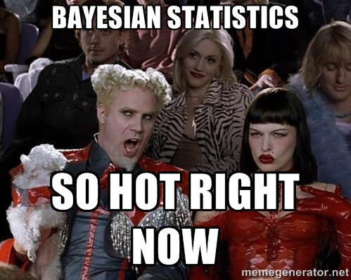

<!--
10 min [10] Peter: A few remarks on the "replication crisis" in psychology
10 min [20] Peter: Statistics: The Status Quo
10 min [35] Peter: Problems with current statistical practices
20 min [55] Fabian: The principled Bayesian
20 min [70] Fabian: The practical Bayesian
40 min [110] Peter: Software for Bayesian data analysis
10 min [120] Peter: Discussion
-->

## Note
- please install http://jasp-stats.org
- and Mplus if you like (on the stick)
- if you're a hacker, git clone the repo **dostodabsi/bayes_workshop**
- otherwise wait for the USB-stick; all materials are on there

# Statistics

## Statistics

> - <div align="center">

</div>

> - There is no *truth*

> - No *correct way*

> - Everyone does different things

> - So what?

## Statistics

Silberzahn, R., et al. (2015). Crowdsourcing data analysis: Do soccer referees give more red cards to dark skin toned players? Center for Open Science, https://osf.io/j5v8f/

> - 29 teams of statisticans around the world

> - Same data set, same question
<div align="center">

</div>

> - What do they do?

## Statistics

- What would you do?

<div align="center">

</div>

## Statistics

- What do they do?

<div align="center">

</div>

## Statistics

- What do they find?

<div align="center">

</div>

## Statistics

- So what?

> - There is a **reproducibility crisis** in Psychology
    * **Partially due to statistics practices!**
    
> - Statistics is a crucial part of our current approach to empirical science.

> - Statistics **can** be useful.

# Bayesian Statistics
  
## Outline

- A few remarks on the "replication crisis" in psychology

- **Statistics: The Status Quo**
    * 1.1 An Example
    * 1.2 Notes on the history of statistics

- **Problems with current statistical practices**
    * 2.1 p-Value Hypothesis Testing
    * 2.2 Confidence intervals: A Solution?

## Outline

- **The principled Bayesian**
    * 3.1 Probability and Bayes' rule
    * 3.2 Binomial example (coin tosses -- what else?)
    * 3.4 Model comparison using Bayes factor

- **The practical Bayesian**
    * 4.1 Creativity example
    * 4.2 Monte Carlo methods
    * 4.3 Markov chain Monte Carlo methods
    * 4.4 Model adequacy and posterior predictive checks

## Outline

- **Software for Bayesian data analysis** <!-- Peter, 40 min [110] -->
    * 5.1 JASP: Examples
    * 5.2 JASP: Practice
    * 5.2 Demo: Bayesian SEM

- **Discussion** <!-- Peter, 10 min [120] -->

    * Outlook
    * Questions

# Statistics: The Status Quo <!-- Peter -->

# The Status Quo in Statistics

## A Bird's Eye View <!-- Fabian -->
  Classical Statistics     Bayesian Statistics
----------------------     ---------------------------
Ad-hoc                     .
.                          .
.                          .
.                          .
.                          .
.                          .
.                          .

<div id="contrast">borrowed from EJ Wagenmakers</div>


## A Bird's Eye View <!-- Fabian -->
  Classical Statistics     Bayesian Statistics
----------------------     ---------------------------
Ad-hoc                     Axiomatic
.                          .
.                          .
.                          .
.                          .
.                          .
.                          .

<div id="contrast">borrowed from EJ Wagenmakers</div>


## A Bird's Eye View <!-- Fabian -->
  Classical Statistics     Bayesian Statistics
----------------------     ---------------------------
Ad-hoc                     Axiomatic
Incoherent                 .
.                          .
.                          .
.                          .
.                          .
.                          .

<div id="contrast">borrowed from EJ Wagenmakers</div>


## A Bird's Eye View <!-- Fabian -->
  Classical Statistics     Bayesian Statistics
----------------------     ---------------------------
Ad-hoc                     Axiomatic
Incoherent                 Coherent
.                          .
.                          .
.                          .
.                          .
.                          .

<div id="contrast">borrowed from EJ Wagenmakers</div>


## A Bird's Eye View <!-- Fabian -->
  Classical Statistics     Bayesian Statistics
----------------------     ---------------------------
Ad-hoc                     Axiomatic
Incoherent                 Coherent
Paradoxical                .
.                          .
.                          .
.                          .
.                          .

<div id="contrast">borrowed from EJ Wagenmakers</div>


## A Bird's Eye View <!-- Fabian -->
  Classical Statistics     Bayesian Statistics
----------------------     ---------------------------
Ad-hoc                     Axiomatic
Incoherent                 Coherent
Paradoxical                Intuitive
.                          .
.                          .
.                          .
.                          .

<div id="contrast">borrowed from EJ Wagenmakers</div>


## A Bird's Eye View <!-- Fabian -->
  Classical Statistics     Bayesian Statistics
----------------------     ---------------------------
Ad-hoc                     Axiomatic
Incoherent                 Coherent
Paradoxical                Intuitive
Irrational                 .
.                          .
.                          .
.                          .

<div id="contrast">borrowed from EJ Wagenmakers</div>


## A Bird's Eye View <!-- Fabian -->
  Classical Statistics     Bayesian Statistics
----------------------     ---------------------------
Ad-hoc                     Axiomatic
Incoherent                 Coherent
Paradoxical                Intuitive
Irrational                 Rational
.                          .
.                          .
.                          .

<div id="contrast">borrowed from EJ Wagenmakers</div>


## A Bird's Eye View <!-- Fabian -->
  Classical Statistics     Bayesian Statistics
----------------------     ---------------------------
Ad-hoc                     Axiomatic
Incoherent                 Coherent
Paradoxical                Intuitive
Irrational                 Rational
Ugly                       .
.                          .
.                          .

<div id="contrast">borrowed from EJ Wagenmakers</div>


## A Bird's Eye View <!-- Fabian -->
  Classical Statistics     Bayesian Statistics
----------------------     ---------------------------
Ad-hoc                     Axiomatic
Incoherent                 Coherent
Paradoxical                Intuitive
Irrational                 Rational
Ugly                       Pretty
.                          .
.                          .

<div id="contrast">borrowed from EJ Wagenmakers</div>


## A Bird's Eye View <!-- Fabian -->
  Classical Statistics     Bayesian Statistics
----------------------     ---------------------------
Ad-hoc                     Axiomatic
Incoherent                 Coherent
Paradoxical                Intuitive
Irrational                 Rational
Ugly                       Pretty
Irrelevant                 .
.                          .

<div id="contrast">borrowed from EJ Wagenmakers</div>


## A Bird's Eye View <!-- Fabian -->
  Classical Statistics     Bayesian Statistics
----------------------     ---------------------------
Ad-hoc                     Axiomatic
Incoherent                 Coherent
Paradoxical                Intuitive
Irrational                 Rational
Ugly                       Pretty
Irrelevant                 Relevant
.                          .

<div id="contrast">borrowed from EJ Wagenmakers</div>


## A Bird's Eye View <!-- Fabian -->
  Classical Statistics     Bayesian Statistics
----------------------     ---------------------------
Ad-hoc                     Axiomatic
Incoherent                 Coherent
Paradoxical                Intuitive
Irrational                 Rational
Ugly                       Pretty
Irrelevant                 Relevant
what's taught              .

<div id="contrast">borrowed from EJ Wagenmakers</div>


## A Bird's Eye View <!-- Fabian -->
  Classical Statistics     Bayesian Statistics
----------------------     ---------------------------
Ad-hoc                     Axiomatic
Incoherent                 Coherent
Paradoxical                Intuitive
Irrational                 Rational
Ugly                       Pretty
Irrelevant                 Relevant
what's taught              what's not taught

<div id="contrast">borrowed from [EJ Wagenmakers](https://docs.google.com/file/d/0B-Ww24m3ZkEyMEpudlVsX3pRVzA/edit)</div>

## What most of us are doing in statistics ...
> "The textbooks are wrong. The teaching is wrong. The seminar
> you just attended is wrong. The most prestigious journal in your
> scientific field is wrong.

> - Ziliak and McCloskey (2008)

## An Example: Creativity and Personality <!-- Peter -->

<div align="center">

</div>

## An Example: Creativity and Personality <!-- Peter -->

<div align="center">

</div>

## An Example: Creativity and Personality

```{r, eval=FALSE}
creadata <- read.csv("crea_bayes.csv") # Load data
summary(lm(fluency ~ N + E + O, data = creadata)) # Multiple regression
```

<div align="center">

</div>

## An Example: Creativity and Personality

- What does *p* tell us?

> - *The probability to get data this or more extreme in case that in the underlying population there is no association between openness and ideational fluency is less than 0.1%*
    * Null hypothesis: association = 0;
    * Reject this null: apply 5% convention -> if *p* < .05.
    * If H0 is true, data very unlikely -> reject H0, accept H1
    * ...do **this same thing** in **all analyses**...

> - Does this sound *strange* to you?

## history: how did we get here? <!-- Peter -->
- quick question: how old do you think is **modern statistics**?

## Ronald A. Fisher


## Ronald A. Fisher

> - *Statistical Methods for Research Workers* (1925), *Design of Experiments* (1935)

> - His **first** approach to *statistical inference*
    * Null hypothesis $H_0$, $\alpha$
    * **no alternative hypothesis.**
    * *p* > .05: ignore results.

> - p-value indicates **strength of evidence**
    * $p = .001$ is **better** than $p = .049$

## Ronald A. Fisher

Revision:
*"No scientific worker has a fixed level of significance at which from year to year, and in all
  circumstances, he rejects hypotheses; he rather gives his mind to each particular case in the light
  of his evidence and his ideas."*

- R.A. Fisher (1956), as cited in [@gigerenzer2015surrogate, p.1]

## Jerzy Neyman and Egon Pearson

- Introduced the alternative hypothesis, $H_1$
    * Concept of a $\beta$ error; statistical power
- $p < \alpha$, or $p > \alpha$
- Binary cut-off; not **statistical evidence**
- They did **behavioral statistics**

## Neyman-Pearson
> *no test based on probability theory can provide evidence
> of truth or falsehood.
> BUT it might govern our behavior,
> in following which we ensure that in the long run of experience,
> we shall not be too often wrong.*

- Neyman and Pearson (1933), as cited in [@johansson2011hail, p.118]

## Unification / bastardization

- 1940s/1950s
    * Psychologists (Guilford) combine both approaches in statistics textbooks
    * Ignoring differences in names (Fisher vs. Neyman & Pearson) and fundamentals (alternative hypothesis vs. none, fixed alpha vs. not)

> - Current statistical practice:
    An *evilish hybrid* between those two **incompatible** paradigms

## Unification / bastardization

*statisticians "have already overrun every branch of science with a rapidity of conquest
rivalled only by Attila, Mohammed, and the Colorado beetle."*

- Did Piaget ever compute a p-value?
- Did Skinner? what's with Köhler? Pavlov?

# Problems with Current Statistical Practices

## Mindless Statistics

- 1a: setup a statistical hypothesis of **no difference** or **zero correlation**
- 1b: don't specify the predictions of your research hypothesis
- 2: Use 0.05 as a convention for rejecting H0
- 3: always use this procedure [@gigerenzer2004mindless]

## What is *Probability?*

- **Frequentists**, probability is the long-run relative frequency of events
    * prob. coin coming up heads: Proportion of heads in **infinite** amount of tosses
    * Asking about probability of next coin toss: **Nonsensical**
    * Next toss: Either heads, or not
    * Single events can't be assigned *probability*
- **Repeatability** becomes a crucial ingredient
- **Fisher**: Biologist, did lots of repeatable experiments

## What is *Probability?*

> - Frequentists cannot talk about...

 * ...the probability of a 3rd world war
 * ...climate change
 * ...you failing your next exam
 * ...**any non repeatable event**
 
> - Sneak peek: Single events are about **uncertainty**

> - Probability conceptualized as long-run average frequency:
  No answer to essential question in science
  *"what is the probability that my hypothesis / theory is true?"*


## What is in a p-value?

*p*...

- ...disproves the null hypothesis of no difference.
- ...proves the alternative hypothesis.
- ...indicates the probability of the null hypothesis being true.
- ...indicates the probability of the alternative hypothesis being true.
- ...indicates the probability of the experimental hypothesis being true.
- ...indicates the probability of a wrong decision in case we reject the null hypothesis.
- ...indicates that in 99% of cases we would obtain a significant result when repeating the experiment.
- ...indicates the probability of the data or more extreme data given that the null hypothesis is true.

## What is in a p-value?

*p*...

- ...disproves the null hypothesis of no difference.
- ...proves the alternative hypothesis.
- ...indicates the probability of the null hypothesis being true.
- ...indicates the probability of the alternative hypothesis being true.
- ...indicates the probability of the experimental hypothesis being true.
- ...indicates the probability of a wrong decision in case we reject the null hypothesis.
- ...indicates that in 99% of cases we would obtain a significant result when repeating the experiment.
- **...indicates the probability of the data or more extreme data given that the null hypothesis is true.**

## What is in a p-value?

[@wagenmakers2007practical]

## What is in a p-value? 
- A frequentist **needs** this sampling distribution
- Often, properties of the sampling distribution can be derived analytically from the sample data
- Variance of the **sampling distribution** of the **sample mean** is $\sigma^2 = \frac{s^2}{N}$
- One reason why frequentism got so much traction: It is computationally trivial!

## The Case of Sally Clark
- both Clark's babies died, where $p(\text{baby dies}) = \frac{1}{8543}$
- thus the probability that both babies died is roughly 1 in 73 million
- since this is soo incredibly low ($p < 0.00001$ or whatnot), Clark **probably killed** her babies
- indeed, in November 1999, a jury found poor Sally guilty of double murder
> - see any problem with that?

## The Case of Sally Clark
> "The jury needs to weigh up two competing explanations for the babies’ deaths: SIDS or murder. The fact that two deaths by SIDS is
> quite unlikely is, taken alone, of little value. Two deaths by murder may well be even
> more unlikely. What matters is the relative likelihood of the deaths under each
> explanation, not just how unlikely they are under one explanation."

- **President of the Royal Statistical Society** (2002)

## The Case of Sally Clark
- in fact, $p(\text{baby dies} | \text{sudden infant death})$ is higher than $p(\text{baby dies} | \text{murder})$
- the ratio of these two - the **likelihood ratio** - is the proper measure of statistical evidence
- statistical evidence is **always** relative; there is **no free lunch**


## The Wrong Probability
- p-value give you $p(\text{D or more extreme}|H_0)$
- what we want is $p(H|D)$, the probability that our hypothesis is true!
- there is a subtle, but important difference
- $p(\text{you are dead} | \text{shark has bitten off your head})$ is very high :(
- $p(\text{shark has bitten off your head} | \text{you are dead})$ is very low!

## The Wrong Probability
- Don't quantify statistical evidence; (Wagenmakers, 2007)
- $p = 0.04, n = 10$ is more evidence than $p = 0.04, n = 1000$
- in fact, the latter is support for $H_0$!
- are violently biased against $H_0$

<!--

## frequentist inference
- assumes that the parameter $\theta$ is fixed
- only the data is allowed to vary
- confidence intervals, statistical power etc. are not properties of the data
- they are properties of the **testing procedure**

-->

## Effect Sizes and Confidence Intervals: The *Frequentist* Solution?
- Effect Size
    * A measure of the strength of an effect
    * e.g., a correlation of *r* = .35, a difference between experimental conditions of Cohen's *d* = 0.30
    
- Confidence interval
    * The area within which in 95% of replications (same experiment/measures, same sample size drawn from the same population) the real parameter (effect) will be

- Example:
    * *There was a significant difference between the control group and the intervention group, p = .002, d = 0.34 [0.22, 0.44]*

## Effect Sizes and Confidence Intervals: A Solution?

<div align="center">

</div>

## Cumming, 2014
* *"We need to make substantial changes to how we conduct research"*

## Cumming, 2014

> - Replicate (x)

> - Adapt meta-analytical thinking (x)

> - Avoid NHST (x)

> - Don't trust any p-value (x)

## Cumming, 2014

<div align="center">

</div>

## Cumming, 2014

- ES are the main research outcome (...?)
- The CI tells us the precision of a study (...?)
    * ...a much better approach than declaring the result "statistically significant" (...?)
- "Enjoy the benefits!" (...?)

## Cumming, 2014

* So, what does a SINGLE confidence interval tell me?
* Nothing

## ES and CI are NOT the solution
### Part I: Morey et al., 2014

* "For psychological science to be a healthy science, both estimation and hypothesis testing are needed."
* Estimation is necessary in pretheoretical work before clear predictions can be made, and for theory revision.
* Hypothesis testing, not estimation, is necessary for testing the quantitative predictions of theories.
* None is more informative than the other.
* They answer different questions.
* Estimation alone produces a massive catalogue devoid of theoretical content.
* Hypothesis testing alone may cause researchers to miss rich, meaningful structure in data.
* **It is crucial for estimation and hypothesis testing to be advocated side by side.**

## ES and CI are NOT the solution
### Part II: Hoekstra et al., 2014

<div align="center">

</div>

## ES and CI are NOT the solution
### Part II: Hoekstra et al., 2014

<div align="center">

</div>

## ES and CI are NOT the solution
### Part III: Lee, 2014

(Lee, [here](https://webfiles.uci.edu/mdlee/Lee2014_NewStatistics.pdf))

<div align="center">

</div>

## Confidence Intervals: A Solution?

> - Effect size estimation is no solution.

> - Apparently, frequentist statistics has something flawed inherent.

## Anybody read the blog?


# The principled Bayesian

## Probability as subjective belief
- "What's the probability that it will rain tomorrow"?
    * Frequentist: "That is a non-sensical question."
    * Bayesian: "I guess about 40%."
- if probabilities are subjective, don't we have a problem?
- how do we quantify them, then?

## Measuring probability


## Measuring probability
- Frank Ramsey had a gread idea (Ramsey, 1926)
- use bets to quantify subjective belief
- for 1$ in return, how much $$ would you bet on
    * Germany winning against Brazil in soccer?
    * that it is going to be at least 30°C tomorrow?

## Measuring probability
- Germany: 3$
- Weather: 5$
- these are (betting) odds
- to convert them into probability, calculate:
$$
Pr = \frac{odds}{1 + odds}
$$
- Germany: $3 / (1 + 3) = .75$
- Weather: $5 / (1 + 5) = .83$

## Measuring probability
- it's not about *any* subjective beliefs
- it's about subjective beliefs that obey probability
- if they do not, we can construct a *Dutch book*
- that is, a bet in which the bettor is guaranteed to lose

## Probability: Sum rule
- an urn holds $N$ balls: $R$ red, $B$ blue, the rest white
- probability of drawing a red ball: $R / N$
- probability of drawing a coloured ball: $R / N + B / N$
- example from @lindley2000philosophy

## Probability: Product rule
- another urn holds $N$ balls: $R$ red, $1 - R$ white, $S$ spotted, $1 - S$ plain
- given that, there are $T$ spotted *and* red balls
- probability of drawing such a ball is: $T / N$
- $\frac{T}{N} = \frac{R}{N} \times \frac{T}{R} = \frac{S}{N} \times \frac{T}{S}$
- what does this mean?

## Probability: Product rule {.small}
+---------------+---------------+--------------------+--------------------+
|               |    RED        |      WHITE         |                    |
+===============+===============+====================+====================+
| SPOTTED       |     T         |                    |         S          |
+---------------+---------------+--------------------+--------------------+
| PLAIN         |               |                    |       1 - S        |
+---------------+---------------+--------------------+--------------------+
|               |     R         |      1 - R         |         N          |
+---------------+---------------+--------------------+--------------------+

## Probability: Product rule {.small}
- we want to find $P(\text{spotted}, \text{red}) = T / N$
$$
\begin{align*}
P(\text{spotted}, \text{red}) &= P(\text{spotted}|\text{red})P(\text{red}) \\[1ex]
\frac{T}{N} &= \frac{T}{R} \times \frac{R}{N} \\[3ex]
P(\text{spotted}, \text{red}) &= P(\text{red}|\text{spotted})P(\text{spotted}) \\[1ex]
\frac{T}{N} &= \frac{T}{S} \times \frac{S}{N}
\end{align*}
$$


## Implication of Sum rule
- $P(\text{red}) = P(\text{red}|\text{spotted}) + P(\text{red}|\text{plain})$
- $P(\text{red})$ is called a marginal probability
- by summing up all the conditional probabilities, we arrive at the marginal probability

## Summing up
- we have derived the intuitive product and sum rule of probability
- this is the core of Bayesian statistics (I'm not kidding!)
- the rest is just being smart about how to apply them


## Bayes' rule: Derivation
- it's just conditional probability:
$$
\begin{align}
P(\text{spotted}, \text{red}) &= P(\text{spotted}|\text{red})P(\text{red}) \\[1ex]
P(\text{spotted}, \text{red}) &= P(\text{red}|\text{spotted})P(\text{spotted}) \\[1ex]
\end{align}
$$

- which yields Bayes' Rule:

$$
\begin{align*}
P(\text{spotted}|\text{red})P(\text{red}) &= P(\text{red}|\text{spotted})P(\text{spotted}) \\[1ex]
P(\text{spotted}|\text{red}) &= \frac{P(\text{spotted}) \times P(\text{red}|\text{spotted})}{P(\text{red})}
\end{align*}
$$

## Bayes' rule: Intuition
- what is the probability of my hypothesis, p($H$), given the data, $\textbf{y}$, I have collected?
$$
p(H|\textbf{y}) = \frac{p(H)p(\textbf{y}|H)}{p(\textbf{y})}
$$


## Some terminology
- with parameter vector $\theta$ and data $\textbf{y}$:
$$
\begin{align*}
p(\theta|\textbf{y}) &= \frac{p(\textbf{y}|\theta)p(\theta)}{p(\textbf{y})} \\[1ex]
\text{posterior} &= \frac{\text{likelihood} \times \text{prior}}{\text{marginal likelihood}} \\[2ex]
\text{posterior} &\sim \text{likelihood} \times \text{prior}
\end{align*}
$$

## Binomial example
- first we quantify our beliefs with a prior distribution, $p(\theta)$
- we specify our statistical model, $p(\textbf{y}|\theta)$
- then we just plug in Bayes' rule, dropping the marginal likelihood:
$$
p(\theta|\textbf{y}) \sim p(\textbf{y}|\theta)p(\theta)
$$

## Binomial example: prior I


## Binomial example: prior II


## Binomial example: prior III


## Conjugacy
- a conjugate prior is a prior that when combined with the likelihood yields a posterior that is of the same
distributional family as the prior
- the parameters of conjugate priors can be interpreted as prior data

## Binomial example: likelihood
- instead of $p(\textbf{y}|\theta)$ we write $\mathcal{L}(\theta; \textbf{y})$
- for the binomial case, we use:
$$
\mathcal{L}(\theta; k, N) = \theta^k \times (1 - \theta)^{N - k}
$$

where $k$ is the number of successes and $N$ the number of data points

## Binomial example: likelihood
- likelihoods are relative, and are *not* probabilities!
- they indicate how likely the data is, given certain parameter values
- assume $k = 2$, $N = 4$:

$$
\begin{align*}
\mathcal{L}(\theta = .5; k = 2, N = 4) = .5^2 \times (1 - .5)^{4 - 2} = .375 \\[1ex]
\mathcal{L}(\theta = .9; k = 2, N = 4) = .9^2 \times (1 - .9)^{4 - 2} = .049
\end{align*}
$$

## Binomial example: likelihood
- likelihoods quantify statistical evidence
- $\theta = .5$ is $.375 / .049 = 7.65$ times more likely than $\theta = .9$ 
- using this method, we can only compare *point* hypotheses
- later we will see how Bayes factors relax this restriction


## Binomial example: posterior
- the posterior is simply a combination of the prior and the likelihood
- in binomial settings, we a have simple updating rule:
$$
\begin{align*}
p(\theta) &\sim \mathcal{Beta}(a, b) \\[1ex]
p(\theta|\textbf{y}) &\sim \mathcal{Beta}(a + k, b + N - k)
\end{align*}
$$


## Binomial example: shiny
- Visualisations from a great blog post by [Alexander Etz](http://alexanderetz.com/2015/08/09/understanding-bayes-visualization-of-bf/)
- explain:
    * Bayesian updating
    * Coherence
    * Cromwell's Rule
    * flat priors and maximum likelihood
    * convergence of initially different prior beliefs
    
## Why most published research findings are false
- Ioannidis (2005) argued that most published research findings are false
- common misconception:
    * $\alpha = .05$, thus number of false positives is only 5%
    * problem: we compute $p(\textbf{y}|H)$ and not $p(H|\textbf{y})$
    * ignores relevant prior information (the base rate of true hypotheses)

## Why most published research findings are false


## Why most published research findings are false
$$
\begin{align*}
PPV &= \frac{TP}{(TP + FP)} \\[1ex]
PPV &= \frac{TP(TP + FN) / (TP + FN)}{TP (TP + FN) / (TP + FN) + FP}
\end{align*}
$$

- recall that:
    * $prior = TP + FN$
    * $power = TP / (TP + FN)$
    
- therefore:
$$
PPV = \frac{power \times prior}{power \times prior + \alpha}
$$

## Interim conclusion I
- to make probability statement about a hypothesis -- you need a prior
- people often forget the prior (base rate), which makes them overconfident
- most published research is indeed likely to be false, due to:
    * publication bias
    * low statistical power [@cohen1962statistical; @button2013power]
    * statistical analysis that is contingent on data [@simmons2011false; @gelman2013garden]


## Interim conclusion I
- Bayesian statistics follows from probability
- it thus inherits favourable properties that classical statistics lacks
- **rationality**: if one violates Bayesian reasoning, one can systematically loose money
- **coherence**: the order of updating one's belief does not matter
- **intuitive**: it allows us to say how probable our hypothesis is after the experiment


## Model comparison
- how strongly can we believe in our hypothesis, given the collected data?
- that is, we want $p(H|\textbf{y})$
- a hypothesis can be instantiated in a model
- $H_0: \delta = 0$ corresponds to a model where the parameter $\delta$ is fixed to 0
- $H_1: \delta \neq 0$ corresponds to a model where the parameter $\delta$ is free to vary

## Bayes factor: Derivation
- assume two models, $M_0$ and $M_1$, that instantiate $H_0$ and $H_1$, respectively
- after we have collected data, $p(\textbf{y})$, which model should we prefer?
- the probability of each model is computed using Bayes' rule:

$$
\begin{align}
p(M_0|\textbf{y}) &= \frac{p(\textbf{y}|M_0)p(M_0)}{p(\textbf{y})} \\[1ex]
p(M_1|\textbf{y}) &= \frac{p(\textbf{y}|M_1)p(M_1)}{p(\textbf{y})}
\end{align}
$$

## Bayes factor: Derivation

$$
\begin{align}
\frac{p(M_0|\textbf{y})}{p(M_1|\textbf{y})} &= \frac{\frac{p(\textbf{y}|M_0)p(M_0)}{p(\textbf{y})}} {\frac{p(\textbf{y}|M_1)p(M_1)}{p(\textbf{y})}} \\[2ex]
\frac{p(M_0|\textbf{y})}{p(M_1|\textbf{y})} &= \frac{p(M_0)}{p(M_1)}\frac{p(\textbf{y}|M_0)}{p(\textbf{y}|M_1)} \\[2ex]
\text{posterior odds} &= \text{prior odds} \times \text{Bayes factor}
\end{align}
$$

## Bayes factor: Intuition
- the Bayes factor is an updating factor
- it tells us how to update our prior beliefs about the hypotheses, given the data
- note that there are two priors: over models $M$, and over parameters $\theta$
- the term $p(\textbf{y}|M_0)$ is the marginal likelihood under model $M_0$
- in other words, it is the probability of the data under model $M_0$
- it quantifies how well this model predicts the data

## Bayes factor: Marginal likelihood
- in parameter estimation, we have avoided this term
- now that we compare models, we cannot do so!
- often it is a high-dimensional integral, which is difficult to compute
- for $M_0$, it is:
$$
p(\textbf{y}|M_0) = \int p(\textbf{y}|\theta, M_0)p(\theta|M_0)\mathrm{d}\theta
$$

- this simply follows from the sum rule discussed before
- it is a weighted average of the likelihood with respect to the prior


## Bayes factor: Interpretation
- the Bayes factor is a generalization of the likelihood ratio
- recall before, we compared $H_0: \theta = .5$ against $H_1: \theta = .9$
- Bayes factors let us test composite hypothesis, like $H_0: \theta \neq .5$
- for this, we have to specify a prior distribution over $\theta$

## Bayes factor: shiny demo
- explain:
    * Bayes factor interpretation
    * Savage-Dickey density ratio
    * parameter estimation versus hypothesis testing
    * hint at intervall null hypothesis
    * remark that Bayes factor looks at *prediction*
    * Bayes factor always interpretable -- regardless of sample size

## Bayes factor: Savage-Dickey density ratio
- a neat mathematical trick to avoid computing the marginal likelihood:

$$
BF_{01} = \frac{p(\delta = 0|H_1, \textbf{y})}{p(\delta = 0|H_1)}
$$


## Bayes factor: Jeffreys-Lindley's paradox
- uninformative priors should not be used
- they lead to unbounded support for $H_0$
- BayesFactor, JASP use default priors


## Interim conclusion II
- Bayes factor quantifies statistical evidence
- allows us to state evidence for $H_0$
- no issue with sequential testing
- does not depend on the sample size
- if the data are uninformative, the Bayes factor will tell you exactly that
- which is an incredibly important feature
- two deficits of *p* values:
    * depend on sample size ($p = .03, N = 1000$ is support for $H_0$, not $H_1$!)
    * if $p > .05$, we don't know if it is due to low power, or uninformative data
    * **people literally died because of this shortcoming**


## Principled conclusion
- again, the sum and product rule are the core of Bayesian statistics
- "Bayesian" is somewhat of a misnomer
- everything follows from the sum and product rule
- the rest is just being smart on how to apply them


# The practical Bayesian
## Setup
- do hats boost creativity?

```{r}
set.seed(1774)

hat <- rnorm(50, 60, 10)
nohat <- rnorm(50, 50, 10)
dat <- data.frame(score = c(nohat, hat), hat = rep(0:1, each = 50))
```

## Setup


## Bayesian approach
- specify a joint distribution over parameters and data, $p(\textbf{y}, \mu, \sigma^2)$, thus:

$$
\begin{align*}
p(\mu, \sigma^2|\textbf{y}) &= \frac{p(\textbf{y}|\mu, \sigma^2)p(\mu, \sigma^2)}{p(\textbf{y})} \\[1ex]
p(\mu, \sigma^2|\textbf{y}) &\sim p(\textbf{y}|\mu, \sigma^2)p(\mu, \sigma^2)
\end{align*}
$$


## Likelihood -- our statistical model
- we assume that the data are normally distributed; for a single datum, thus:
$$
\begin{equation*}
\mathcal{L}(\mu, \sigma^2; y) = \frac{1}{\sqrt{2\pi\sigma^2}} \exp(\frac{-(y - \mu)^2}{2\sigma^2})
\end{equation*}
$$

- assuming *exchangeability*, we can write:

$$
\begin{equation*}
\mathcal{L}(\mu, \sigma^2; \textbf{y}) = \prod_{i = 1}^n \frac{1}{\sqrt{2\pi\sigma^2}} \exp(\frac{-(y_i - \mu)^2}{2\sigma^2})
\end{equation*}
$$


## Likelihood -- what is it?
- likelihood denotes the probability of the data, given certain fixed parameter values

$$
\begin{align*}
\mathcal{L}(\mu = 40, \theta = 15; y = 50) &= .0213 \\
\mathcal{L}(\mu = 50, \theta = 15; y = 50) &= .0266
\end{align*}
$$


## Prior
- In Bayesian inference, we need to formalize our belief before seeing the data
- doing this over $\mu$ and $\sigma^2$ simultanously is difficult
- thus we make the simplifying assumption that the priors are independent
- $p(\mu, \sigma^2) = p(\mu)p(\sigma^2)$
- because we are simply estimating parameters, we do not need to specify informative priors

## Prior specification

$$
\begin{align*}
p(\mu) &\sim \mathcal{N}(\mu_0, \omega_0^2) \\
p(\sigma^2) &\sim \mathcal{IG}(v_0, \frac{v_0 \sigma_0^2}{2})
\end{align*}
$$

- we specify a normal over $\mu$, and an inverse gamma over $\sigma^2$
- this prior specification is *semi-conjugate*:

$$
\begin{align*}
p(\mu|\textbf{y}, \sigma^2) &\sim \mathcal{N}(\mu, \omega^2) \\
p(\sigma^2|\textbf{y}, \mu) &\sim \mathcal{IG}(v_1, S)
\end{align*}
$$

where $\omega^2$ depends on $\sigma^2$ and $S$ depends on $\mu$

## Posterior distribution
- we don't get marginal posterior distributions, $p(\mu|\textbf{y})$ and $p(\sigma^2|\textbf{y})$ when using independent priors
- but it is those that we want for drawing inferences!
- use **Markov chain Monte Carlo** methods (in this case: *Gibbs Sampling*)
- let's first discuss Monte Carlo on a simple example [@rouder2005introduction]

## distribution of reaction times
- reaction times are not (log)normally distributed
- instead, an Ex-Gaussian distribution fits best
- it is the sum of an exponential and a Gaussian
$$
x | \eta \sim \mathcal{N}(\mu + \eta, \sigma^2) \\[1ex]
\eta \sim \mathcal{Exp}(\nu)
$$

## distribution of reaction times
- but we do not want $x | \eta$ (conditional probability)
- we want $x$ (marginal probability)
- analytically, one would apply the sum rule and "integrate out" $\nu$
- however, that is not tractable -- so instead, we use Monte Carlo methods
- this are computer based methods to solve hard problems

## Monte Carlo principle
- **anything we want to know about a random variable $\theta$ can be learned by sampling
many times from f($\theta$), the density of $\theta$**
- in R, we can sample randomly from different probability distributions
- for example, "rnorm", "rbeta", "rgamma", "rexp"

## Monte Carlo integration
- we sample from $\eta$ using "rexp" and use this value for $x | \eta$ in "rnorm"
$$
\eta \sim \mathcal{Exp}(\nu) \\[1ex]
x | \eta \sim \mathcal{N}(\mu + \eta, \sigma^2)
$$

## Monte Carlo integration
```{r}
exgauss <- function(mu, sigma, rate, times = 1000) {
  res <- rep(NA, times)
  
  for (i in 1:times) {
    nu <- rexp(1, rate)
    res[i] <- rnorm(1, mu + nu, sigma)
  }
  
  res
}
```

## Monte Carlo integration


## Monte Carlo integration
- is quite a neat technique!
- let's generalize it to Gibbs Sampling
- in our creativity example, both distributions are conditional on each other
- in a sense, now we have to do monte carlo integration for both of them
- we do this iteratively, in each step drawing from both distributions, conditional on the other value

## Gibbs Sampling
```{r}
gibbs <- function(mu0, w0, v0, sigma0, y, n.iter = 8000, burnin = n.iter / 4) {
  n <- length(y)
  
  v1 <- v0 + n
  mu_post <- rep(mean(y), n.iter)
  var_post <- rep(var(y), n.iter)
  
  for (i in 2:n.iter) {
    mu <- mu_post[i-1]
    sigma2 <- var_post[i-1]
    w1 <- 1 / (n / sigma2 + 1 / w0^2) # condition on current variance
    mu1 <- ((n / sigma2) * mean(y) + (1 / w0^2) * mu0) / (n / sigma2 + 1 / w0^2)
    mu_post[i] <- rnorm(1, mu1, sqrt(w1))
    S <- sum((y - mu)^2) # condition on current mean
    var_post[i] <- 1 / rgamma(1, v1 / 2, S / 2)
  }
  cbind(mu_post, var_post)[-(1:burnin), ]
}
```

## Gibbs Sampling
- why is this called a Markov chain Monte Carlo technique?
- Markov chain because the values are dependent on each other
- we don't want this, so we "burn-in" the first few samples
- we can also do thinning -- only keep every second draw
- it is important to check convergence

## Posterior distributions
- for parameter estimation we can specify uninformative priors:
$$
\begin{align}
\omega_0^2 = 1000 \\
\nu_0 = .0001 \\
\sigma_0^2 = .0001
\end{align}
$$

## Posterior distributions


## Is our model adequate?
- the Bayes factor is relative
- just because a model is favoured very strongly against another, doesn't make it any good
- we have to check for the model's adequacy -- against the real world
- in a Bayesian setting, this is done using *posterior predictive checks*
- we simulate data from our model and check if it gravely misrepresents the observed data

## Posterior predictive checks
- more formally, we compute:
$$
p(\textbf{y}_{rep}|\textbf{y}) = \int p(\textbf{y}_{rep},|\theta)p(\theta|\textbf{y})\mathrm{d}\theta
$$
- we can then use plots and visualisations to assess possible discrepancies

## Posterior predictive checks: no-hat condition


## Posterior predictive checks: hat condition


## Posterior predictive checks
- alright -- but we might want to quantify the discrepancy
- and test whether there is *significant* deviation
- yes, I just used the word *significant*
- for each posterior predictive sample, we can apply a function *T* which returns some
value of interest (test statistic)
- this yields a distribution of those values
- we can then apply the function to our observed data, and see if the outcome is extreme
w.r.t. to the distribution

## Posterior predictive *p* values
- formally, we compute:
$$
p = p(T(y_{rep}, \theta)) \geq T(\textbf{y}, \theta|\textbf{y}))
$$

## Posterior predictive *p* values
- for the hat condition it looks like there might be outliers
- a simple (naive?) approach would be to use *min* as the test statistic

## Posterior predictive *p* values


## Effect size


## Effect size
- in this case, it's obvious that hats make a substantial difference
- these data pass the *interocular traumatic test*
- they are so obvious -- it hits you right between the eyes!
- in the real world, however, things are rarely that clear:
- "... the enthusiast's interocular trauma may be the skeptic's random error. A little arithmetic to verify the extent of the trauma can yield great peace of mind for little cost." [@edwards1963bayesian, p. 217]

## BayesFactor R-package
```{r, eval = FALSE}
libray('BayesFactor')

lmBF(score ~ hat, data = dat)

## Bayes factor analysis
## --------------
## [1] hat : 11448182 ±0%
## 
## Against denominator:
##   Intercept only 
## ---
## Bayes factor type: BFlinearModel, JZS
```


# Software for Bayesian data analysis

## JASP: Example
- developed by a research group around Jonathon Love in Amsterdam
- provides a free, open-source, modern alternative to SPSS
- does frequentist as well as Bayesian inference
- computes Bayes factors -- providing us with a great peace of mind

## JASP: Example
- in replication research, being able to support the null hypothesis is crucial
- Topolski and Sparenberk (2012) found that counter clockwise movements lead to an orientation towards the future and novelty
- Wagenmakers et al. (2015) directly replicated this research

## JASP: Example

*Turning the hands of time - with kitchen rolls!*


# Exercise

## JASP: Example
- you can find the pre-registration form of this research [here](https://osf.io/p3isc/), see the section **sampling plan**
- they failed to replicate the effect; the data were about 10 times more likely under $H_0$ then under $H_1$
- descriptives point in the other direction than originally observed (higher openness when counter clock wise)

## JASP: Example

*Bathing habits - compensating loneliness wit heat!*

- lonely people compensate the lack of social warmth by taking warmer showers and baths [@bargh2012bath]
- ummmmmmm, really?
- @donnellan2014association tried to replicate this in 9 experiments with over 3000 participants
- @wagenmakers2015absence re-analysed the data using Bayesian inference

# Exercise

## JASP: Example
- *p* values are uniformly distributed under $H_0$
- Difference: $p > 0.05$, the data are uninformative
  vs. $p > 0.05$, the data are informative and support $H_0$
- Frequentist statistics:
  We don't know which one is the case
- Bayesfactor:
  We know which one is the case!
  -> Quantifies support for $H_0$ 

# Questions

## Dataset

- Executive functions, intelligence, personality, **creativity** + insight

<div align="center">

</div>

- *N* = 230 university students

## Bayesian SEM

Structural Equation Modeling

> - Analysis of (variance) **covariance** (mean) structures
    * Compare whether "theoretically allowed" parameter estimates suffice to approximate empirical data

<div align="center">

</div>

## Bayesian SEM

Structural Equation Modeling

- Analysis of (variance) **covariance** (mean) structures
    * Compare whether "theoretically allowed" parameter estimates suffice to approximate empirical data

<div align="center">

</div>

## Bayesian SEM

Structural Equation Modeling

- Analysis of (variance) **covariance** (mean) structures
    * Compare whether "allowed" parameter estimates suffice to approximate empirical data

- Emphasis on *latent variables*
    * Non-observed variables representing psychological constructs
    * Get rid of measurement error

- Highly flexible approach

## Bayesian SEM: Descriptives

<div align="center">

</div>

## Bayesian SEM: Descriptives

<div align="center">

</div>

## Bayesian SEM: Descriptives

<div align="center">

</div>

## Bayesian SEM: t-test

<div align="center">

</div>

## Bayesian SEM: t-test

<div align="center">

</div>

## Bayesian SEM: (Multiple) Regression/AN(C)OVA/GLM

<div align="center">

</div>

## Bayesian SEM: (Multiple) Regression/AN(C)OVA/GLM

<div align="center">

</div>

## Bayesian SEM: RMANOVA

<div align="center">

</div>

## Bayesian SEM: RMANOVA + SEM freedom

<div align="center">

</div>


## Bayesian SEM: RMANOVA + SEM freedom

<div align="center">

</div>

## Bayesian SEM: RMANOVA + SEM freedom

Latent growth model

<div align="center">

</div>

## Bayesian SEM: RMMANOVA -> Cross-lagged model

<div align="center">

</div>

## Bayesian SEM: CFA

approximate MI -> van de Schoot et al., 2013B

## Bayesian SEM: Group Comparisons

> - Mean comparisons

> - Multigroup CFA

## Bayesian SEM

> - Break out of schematic statistical testing
    * There is no sense in sticking to "t-test", "ANOVA", "MANOVA", "ANCOCA", "RMANOVA"
    * Cross the borders, build **your own** model

## A1. Reporting Bayesian Analysis

- Prior choice (informative/non-informative, rationales)
- Convergence: Trace plots (for important parameters)
    * see also van de Schoot et al., 2013

## A2. Literature

**JEPS Bulletin blog posts:**
http://blog.efpsa.org/2014/11/17/bayesian-statistics-what-is-it-and-why-do-we-need-it-2/
http://blog.efpsa.org/2015/08/03/bayesian-statistics-why-and-how/

**Application in R and Mplus:**
van de Schoot, R., Kaplan, D., Denissen, J., Asendorpf, J. B., Neyer, F. J., & van Aken, M. A. (2013). A gentle introduction to Bayesian analysis: Applications to developmental research. Child Development, 85, 841-860. doi:10.1111/cdev.12169

**Application in R:**
Kruschke, J. K. (2014). Doing bayesian data analysis: A tutorial with R, JAGS, and Stan (2nd ed.).  Academic Press.

**Bayesian SEM in Mplus:**
Kaplan & Depaoli (2012). Bayesian Structural Equation Modeling. In: Hoyle, R. H.(Ed): Handbook of Structural Equation Modeling. pp.650-673. Guilford Press.

## A3. Software

(From most user-friendly to most elaborate)

- JASP http://jasp-stats.org

- BayesFactor http://bayesfactorpcl.r-forge.r-project.org

- Mplus http://statmodel.com/
    * Kaplan & Depaoli, 2012; van de Schoot et al., 2013

- JAGS http://mcmc-jags.sourceforge.net

- Stan http://mc-stan.org

## ReferencesI

Barker, D. H., Rancourt, D., & Jelalian, E. (2014). Flexible Models of Change: Using Structural Equations to Match Statistical and Theoretical Models of Multiple Change Processes. Journal of Pediatric Psychology, 39(2), 233-245. http://doi.org/10.1093/jpepsy/jst082

Van de Schoot, R., Kaplan, D., Denissen, J., Asendorpf, J. B., Neyer, F. J., & van Aken, M. A. G. (2013). A Gentle Introduction to Bayesian Analysis: Applications to Developmental Research. Child Development, 85, 841-860. http://doi.org/10.1111/cdev.12169

Van de Schoot, R., Kluytmans, A., Tummers, L., Lugtig, P., Hox, J., & Muthén, B. (2013). Facing off with Scylla and Charybdis: a comparison of scalar, partial, and the novel possibility of approximate measurement invariance. Frontiers in Psychology, 4. http://doi.org/10.3389/fpsyg.2013.00770

## References

