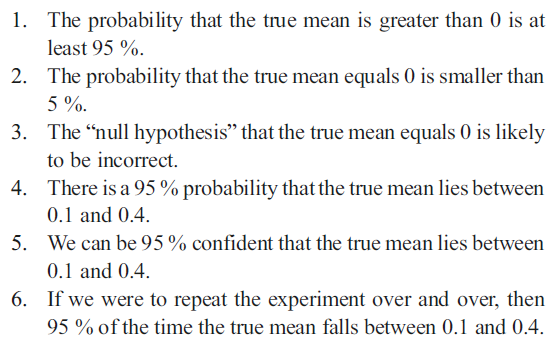
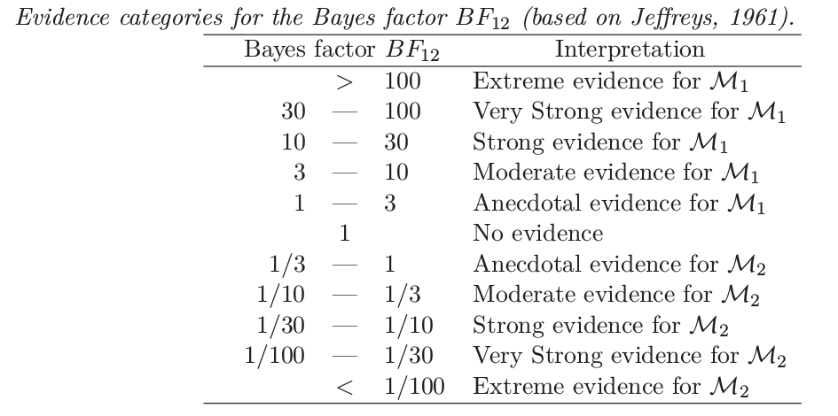

<!--  GENERAL REMARKS:
      - I changed the order of the five death acts of the p-value; this is jsut a suggestion
        I think that it would fit nicely ti bring the H0 and H1-related acts after each other,
        culminating in the fact that theyanswer the wrong question;
        therefore, I moved the optional stopping to be the second act
        - I marked each slide with the name of who I think should present it.
          You'll notice two things:
          First, you present much more than me. This has the reason that I think when one person
          presents more than the other it is nicer, but also I think that all topics I marked wit hyour name
          just fit you so well :D I think you could talk great about everything I marked with your name.
          Second, in my suggestionas it is now, I'd have three short parts. This might seem strange since we switch
          quite "often" but from my experience, all short workshops I've seen so far
          that were given by two people, it turned out to be especially nice when they switched;
          it just relaxes the atmosphere. Also, thrice is not so often I think...
-->

<!-- I'd not show but rather say these things while presenting the title slide

## Attend at your own peril
- you will hear things you probably have never heard before ...
- ... and neither has your statistics teacher or thesis advisor
- all this will be **heavy** statistical re-education
- you will be a different person after this workshop
- but trust us, it will be awesome

-->

## Outline <!-- Fabian -->

<!--  Comment on the outline:
      The sub-points are not important to short or mention here,
      they just provide a structure for ourselves
--> 

- Statistics: The Status Quo
    * 1.1 A Bird's Eye's View
    * 1.2 An Example
    * 1.3 Notes on the history of statistics
- p-Values: A Death in Five Acts
    * 2.1 Sampling: Hidden subjectivity
    * 2.2 Sampling: When to stop?
    * 2.3 Inference: Statistical Evidence
    * 2.4 Inference: There is no free lunch
    * 2.5 Inference: Answer the wrong question
    
## Outline
    
- Confidence Intervals and Effect size: A Frequentist solution?
    
- Likelihoods, with demo
    
- Elegant extension: Bayesian Inference
    * 4.1 Prior distributions
    * 4.2 Bayes factors, with demo
    * 4.3 Credibility Intervals

## Outline

- Practical Bayes
    * 6.1 JASP
    * 6.2 turning the hands of time
    * 6.3 loneliness and bathing habits
    * 6.4 do women talk more than men?
    * 6.5 testes size and caregiving

- Where to go from here?

## note
- if you have internet, please install http://jasp-stats.org
- let's do it!

# The Status Quo in Statistics

## A Bird's Eye's View <!-- Fabian -->
  Classical Statistics     Bayesian Statistics
----------------------     ---------------------------
Ad-hoc                     .
.                          .
.                          .
.                          .
.                          .
.                          .
.                          .

<div id="contrast">borrowed from EJ Wagenmakers</div>


## A Bird's Eye's View <!-- Fabian -->
  Classical Statistics     Bayesian Statistics
----------------------     ---------------------------
Ad-hoc                     Axiomatic
.                          .
.                          .
.                          .
.                          .
.                          .
.                          .

<div id="contrast">borrowed from EJ Wagenmakers</div>


## A Bird's Eye's View <!-- Fabian -->
  Classical Statistics     Bayesian Statistics
----------------------     ---------------------------
Ad-hoc                     Axiomatic
Incoherent                 .
.                          .
.                          .
.                          .
.                          .
.                          .

<div id="contrast">borrowed from EJ Wagenmakers</div>


## A Bird's Eye's View <!-- Fabian -->
  Classical Statistics     Bayesian Statistics
----------------------     ---------------------------
Ad-hoc                     Axiomatic
Incoherent                 Coherent
.                          .
.                          .
.                          .
.                          .
.                          .

<div id="contrast">borrowed from EJ Wagenmakers</div>


## A Bird's Eye's View <!-- Fabian -->
  Classical Statistics     Bayesian Statistics
----------------------     ---------------------------
Ad-hoc                     Axiomatic
Incoherent                 Coherent
Paradoxical                .
.                          .
.                          .
.                          .
.                          .

<div id="contrast">borrowed from EJ Wagenmakers</div>


## A Bird's Eye's View <!-- Fabian -->
  Classical Statistics     Bayesian Statistics
----------------------     ---------------------------
Ad-hoc                     Axiomatic
Incoherent                 Coherent
Paradoxical                Intuitive
.                          .
.                          .
.                          .
.                          .

<div id="contrast">borrowed from EJ Wagenmakers</div>


## A Bird's Eye's View <!-- Fabian -->
  Classical Statistics     Bayesian Statistics
----------------------     ---------------------------
Ad-hoc                     Axiomatic
Incoherent                 Coherent
Paradoxical                Intuitive
Irrational                 .
.                          .
.                          .
.                          .

<div id="contrast">borrowed from EJ Wagenmakers</div>


## A Bird's Eye's View <!-- Fabian -->
  Classical Statistics     Bayesian Statistics
----------------------     ---------------------------
Ad-hoc                     Axiomatic
Incoherent                 Coherent
Paradoxical                Intuitive
Irrational                 Rational
.                          .
.                          .
.                          .

<div id="contrast">borrowed from EJ Wagenmakers</div>


## A Bird's Eye's View <!-- Fabian -->
  Classical Statistics     Bayesian Statistics
----------------------     ---------------------------
Ad-hoc                     Axiomatic
Incoherent                 Coherent
Paradoxical                Intuitive
Irrational                 Rational
Ugly                       .
.                          .
.                          .

<div id="contrast">borrowed from EJ Wagenmakers</div>


## A Bird's Eye's View <!-- Fabian -->
  Classical Statistics     Bayesian Statistics
----------------------     ---------------------------
Ad-hoc                     Axiomatic
Incoherent                 Coherent
Paradoxical                Intuitive
Irrational                 Rational
Ugly                       Pretty
.                          .
.                          .

<div id="contrast">borrowed from EJ Wagenmakers</div>


## A Bird's Eye's View <!-- Fabian -->
  Classical Statistics     Bayesian Statistics
----------------------     ---------------------------
Ad-hoc                     Axiomatic
Incoherent                 Coherent
Paradoxical                Intuitive
Irrational                 Rational
Ugly                       Pretty
Irrelevant                 .
.                          .

<div id="contrast">borrowed from EJ Wagenmakers</div>


## A Bird's Eye's View <!-- Fabian -->
  Classical Statistics     Bayesian Statistics
----------------------     ---------------------------
Ad-hoc                     Axiomatic
Incoherent                 Coherent
Paradoxical                Intuitive
Irrational                 Rational
Ugly                       Pretty
Irrelevant                 Relevant
.                          .

<div id="contrast">borrowed from EJ Wagenmakers</div>


## A Bird's Eye's View <!-- Fabian -->
  Classical Statistics     Bayesian Statistics
----------------------     ---------------------------
Ad-hoc                     Axiomatic
Incoherent                 Coherent
Paradoxical                Intuitive
Irrational                 Rational
Ugly                       Pretty
Irrelevant                 Relevant
what's taught              .

<div id="contrast">borrowed from EJ Wagenmakers</div>


## A Bird's Eye's View <!-- Fabian -->
  Classical Statistics     Bayesian Statistics
----------------------     ---------------------------
Ad-hoc                     Axiomatic
Incoherent                 Coherent
Paradoxical                Intuitive
Irrational                 Rational
Ugly                       Pretty
Irrelevant                 Relevant
what's taught              what's not taught

<div id="contrast">borrowed from EJ Wagenmakers</div>


## put succinctly ...
> "The textbooks are wrong. The teaching is wrong. The seminar
> you just attended is wrong. The most prestigious journal in your
> scientific field is wrong.”

> - Ziliak and McCloskey (2008)

## An Example: Risk Behaviour and Social Status <!-- Peter -->

<!--  Show example in R: Research Question:
      Is Risk Behaviour related to Popularity (how popular classs peers rate you)
      and to Likeability (how much class peers like you)
      -> Discuss: What does the p-value tell us?
      -> Is there something strange about it? Yes?
      - in that case, let's explore why we use this stuff!
-->

<div align="center">

</div>

## An Example: Risk Behaviour and Social Status <!-- Peter -->

```{r, eval=FALSE}

setwd("C:/Users/.../bayes_workshop/data") # Set working directory
risk_bayes <- read.csv("riskdata_bayes.csv") # Load data
attach(risk_bayes) # Set data as working file
summary(lm(risksum~ZPop+ZLike)) # Multiple regression

```

<div align="center">

</div>

## An Example: Risk Behaviour and Social Status <!-- Peter -->

- What does *p* tell us?

- *The probability to get data this or more extreme in case that in the underlying population there is no association between popularity/likeability and risk behaviour is less than 0.1%*

- Does this sound *strange* to you?


## history: how did we get here? <!-- Fabian -->
- quick question: how old do you think is **modern statistics**?

## Ronald A. Fisher


## Ronald A. Fisher
- **Statistical Methods for Research Workers** (1925)
- **Design of Experiments** (1935)
- only talked about $H_0$ and $\alpha$; no alternative hypothesis! no power!
- p-value indicates **strength of evidence**!
- that is, $p = 0.001$ is **better** than $p = 0.049$


## Ronald A. Fisher
> "No scientific worker has a fixed level of significance at which from year to year, and in all
> circumstances, he rejects hypotheses; he rather gives his mind to each particular case in the light
> of his evidence and his ideas."

## Jerzy Neyman and Egon Pearson
- extended Fisher's work, but **changed it substantially**
- introduced the alternative hypothesis, $H_1$
- concept of a $\beta$ error; statistical power
- $p < \alpha$, or $p > \alpha$
- binary cut-offs; not **statistical evidence**!
- they did **behavioral statistics**

## Neyman-Pearson
> "We are inclined to think that as far
> as a particular hypothesis is concerned, no test based upon the theory
> of probability can by itself provide any valuable evidence of
> the truth or falsehood of that hypothesis.


## Neyman-Pearson
> "We are inclined to think that as far
> as a particular hypothesis is concerned, no test based upon the theory
> of probability can by itself provide any valuable evidence of
> the truth or falsehood of that hypothesis.

> But we may look at the
> purpose of tests from another view-point. **Without hoping to know**
> **whether each separate hypothesis is true or false**, we may search
> for rules to **govern our behaviour** with regard to them, in following
> which we insure that, in the long run of experience, we shall not be too often wrong."

## unification / bastardization
- in the 40s and 50s **psychologists** (i.e. Guilford) wrote popular statistics books
- they **did not** distinguish between Fisher's and Neyman-Pearson's approach
- current statistical practice is a hybrid between those two **incompatible** paradigms

## unification / bastardization
> statisticians "have already overrun every branch of science with a rapidity of conquest
> rivalled only by Attila, Mohammed, and the Colorado beetle."

- did Piaget ever compute a p-value?
- did Skinner? what's with Köhler? Pavlov?

## mindless statistics
- 1a: setup a statistical hypothesis of **no difference** or **zero correlation**
- 1b: don't specify the predictions of your research hypothesis
- 2: Use 0.05 as a convention for rejecting the null
- 3: always use this procedure [@gigerenzer2004mindless]


## what is probability? <!-- Fabian -->
- for frequentists, probability is the long-run relative frequency of events
- for example, the probability of a coin coming up heads is the proportion of heads in an **infinite** amount of tosses
- to ask about the probability of the next coin toss being heads is **nonsensical**
- the next coin toss is either heads, or it is not
- single events can't be assigned probability!
- **repeatability** becomes a crucial ingredient
- **Fisher**: geneticist, worked in agriculture, did lots of repeatable experiments
- **Jeffreys**: geophysicist, studied earthquakes etc., no way of repeating experiments

## what is probability?
- frequentists cannot talk about
 * the probability of a 3rd world war
 * climate change
 * you failing your next exam
 * any non repeatable event
- these issues are about **uncertainty**, and need a Bayesian take on probability
- by conceptualising probability as long-run average frequency, classical statistics deprived itself of answering the essential question in science
- ***what is the probability that my hypothesis / theory is true?***

# what is in a p-value? <!-- Fabian -->

## some statements
- suppose you run an experiment testing the effect of some treatment
- you have a control group (n = 20) and a treatment group (n = 20)
- you run an independent t-test and get $t(18) = 2.7, p = 0.01$
- let's rate some statements!

## statement 1
- You have absolutely disproved the null hypothesis of no difference.

## statement 1


## statement 1
- You have absolutely disproved the null hypothesis of no difference.
- everything in statistics is probabilistic, there are no **absolutes**

## statement 2
- You have found the probability of the null hypothesis being true.

## statement 2


## statement 2
- You have found the probability of the null hypothesis being true.
- in classical statistics, you cannot assign probabilities to your hypotheses
- but every researcher really, really, really, really wants that!
- one reason for Bayesian statistics ;)

## statement 3
- You have absolutely proved your experimental hypothesis (there is a difference).

## statement 3


## statement 3
- You have absolutely proved your experimental hypothesis (there is a difference).
- same as statement 1: probabilistic, not absolute!

## statement 4
- You can deduce the probability of the experimental hypothesis being true.

## statement 4


## statement 4
- You can deduce the probability of the experimental hypothesis being true.
- same as statement 2: can't assign probabilities to hypotheses!

## statement 5
- You know, if you decide to reject the null hypothesis, the probability that you are making the wrong decision.

## statement 5


## statement 5
- You know, if you decide to reject the null hypothesis, the probability that you are making the wrong decision.
- ummm, isn't that $\alpha$?
- **classic** NO: $\alpha$ is about an infinite amount of experiments
- in this case, the probability is $1 - p(H_0)$
- cannot get $p(H_0)$ without Bayes, so this statement is wrong


## statement 6
- You have a reliable experimental finding in the sense that, if the experiment were repeated a great number of times, you would obtain a significant result on 99% of occasions.

## statement 6


## statement 6
- You have a reliable experimental finding in the sense that, if the experiment were repeated a great number of times, you would obtain a significant result on 99% of occasions.
- that's the **replication fallacy** [@haller2002misinterpretations]

## how often do people get it wrong?


# p-values: a death in five acts <!-- Fabian -->

## act I <!-- Fabian -->


## act I <!-- Fabian -->
- result of statistical analysis depends on the intention of the researcher
- because those intentions define the space of all possible (unobserved) data [@wagenmakers2007practical]


## act I
- suppose I ask you 26 questions on Bayesian stats, and you get 8 right
- the last question you answered, you answered correctly
- were you better than chance? $H_0: \theta = 0.5$
- there are two possible sampling plans
- ask 26 questions, and see how many you answered correctly (**binomial**)
- ask questions so long until you answer 8 correctly (**negative binomial**)
- ***the data are the data are the data*** (example from Kruschke, 2010, Ch. 11)

## act I


## act I
```{r}
N <- 26
k <- 8

binomial <- pbinom(k, N, 0.5) * 2
negbinomial <- pnbinom(k, N, 0.5) * 2

binomial # fail to reject

negbinomial # science paper!!
```


## act II <!-- Fabian -->
- optional stopping [@sanborn2014frequentist; @rouder2014optional]
- look at data, test, gather more data, test, etc.

## act II, demo
```{r, message = FALSE, eval = FALSE}
source("http://rynesherman.com/phack.r") # read in the p-hack function

res <- phack(initialN=30, hackrate=5, grp1M=0, grp2M=0, grp1SD=1, grp2SD=1,
   maxN=200, alpha=.05, alternative="two.sided", graph=TRUE, sims=2000)
```

## act II, demo


## act II, implications
- inflated $\alpha$ (p-hacking!)
- assume you tested 20 participants, and get $p = 0.057$
- unethical
- money & ressources
- just downright horrible

## act II, Bayes note
> "the rules governing when data collection stops are irrelevant to data interpretation. It
> is entirely appropriate to collect data **until a point has been proven or disproven**, or until
> the data collector runs out of time, money, or patience."

- Edwards et al. (1963)


## act III <!-- Fabian -->
- don't quantify statistical evidence; @wagenmakers2007practical
- $p = 0.04, n = 10$ is more evidence than $p = 0.04, n = 1000$
- in fact, the latter is support for $H_0$!
- are violently biased against $H_0$

## act IV <!-- Fabian -->
- violently biased against $H_0$
- underlying logic of p-values: either the null hypothesis is false, or a rare event has occured
- following example taken from Rouder et al. (in press)

## p-values: flawed reasoning
- the following is logically correct:
- (Premise): If Hypothesis $H$ is true, then event $X$ will not occur.
- (Premise): Event $X$ occured.
- (Conclusion): Hypothesis $H$ is not true.

## p-values: flawed reasoning
- this **does not** translate to probabilistic settings
- (Premise): If Hypothesis $H$ is true, then event $X$ is **unlikely**.
- (Premise): Event $X$ occured.
- (Conclusion): Hypothesis $H$ is **probably not true**.

## p-values: flawed reasoning
- take this example as demonstration:
- (Premise): If Jane is an American, then it will be unlikely that she is a U. S. Congressperson.
- (Premise): Jane is a U. S. Congressperson.
- (Conclusion): Jane is probably not an American.
- by only looking at $p(D|H_0)$, p-values are violently biased against $H_0$

## the case of Sally Clark
- both Clark's babies died, where $p(\text{baby dies}) = \frac{1}{8543}$
- thus the probability that both babies died is roughly 1 in 73 million
- since this is soo incredibly low ($p < 0.00001$ or whatnot), Clark **probably killed** her babies
- indeed, in November 1999, a jury found poor Sally guilty of double murder

## see any problem with that?

## the case of Sally Clark
> "The jury needs to weigh up two competing explanations for the babies’ deaths: SIDS or murder. The fact that two deaths by SIDS is
> quite unlikely is, taken alone, of little value. Two deaths by murder may well be even
> more unlikely. What matters is the relative likelihood of the deaths under each
> explanation, not just how unlikely they are under one explanation."

- **President of the Royal Statistical Society** (2002)

## the case of Sally Clark
- in fact, $p(\text{baby dies} | \text{sudden infant death})$ is higher than $p(\text{baby dies} | \text{murder})$
- the ratio of these two - the **likelihood ratio** - is the proper measure of statistical evidence
- statistical evidence is **always** relative; there is **no free lunch**


## act V <!-- Fabian -->
- p-value give you $p(\text{D or more extreme}|H_0)$
- what we want is $p(H|D)$, the probability that our hypothesis is true!
- there is a subtle, but important difference
- $p(\text{you are dead} | \text{shark has bitten off your head})$ is very high :(
- $p(\text{shark has bitten off your head} | \text{you are dead})$ is very low!


## Effect Sizes and Confidence Intervals: The *Frequentist* Solution?
- Effect Size
    * A measure of the strength of an effect
    * e.g., a correlation of *r* = .35, a difference between experimental conditions of Cohen's <em>d</em> = 0.30
    
- Confidence interval
    * The area within which in 95% of replications (same experiment/measures, same sample size drawn from the same population) the real parameter (effect) will be

- Example:
    * *There was a significant difference between the control group and the intervention group, p = .002, d = 0.34 [0.22, 0.44]*

## Effect Sizes and Confidence Intervals: A Solution?

<div align="center">

</div>

## Cumming, 2014
* *"We need to make substantial changes to how we conduct research"*

## Cumming, 2014
- Replicate (x)
- Adapt meta-analytical thinking (x)
- Avoid NHST (x)
- Don't trust any p-value (x)

## Cumming, 2014

<div align="center">

</div>

## Cumming, 2014

- ES are the main research outcome (...?)
- The CI tells us the precision of a study (...?)
  	* ...a much better approach than declaring the result "statistically significant" (...?)
- "Enjoy the benefits!" (...?)

## Cumming, 2014

* So, what does a SINGLE confidence interval tell me?
* Nothing

## ES and CI are NOT the solution
### Part I: Morey et al., 2014

* "For psychological science to be a healthy science, both estimation and hypothesis testing are needed."
* Estimation is necessary in pretheoretical work before clear predictions can be made, and for theory revision.
* Hypothesis testing, not estimation, is necessary for testing the quantitative predictions of theories.
* None is more informative than the other
* They answer different questions.
* Estimation alone produces a massive catalogue devoid of theoretical content
* Hypothesis testing alone may cause researchers to miss rich, meaningful structure in data.
* It is crucial for estimation and hypothesis testing to be advocated side by side

## ES and CI are NOT the solution
### Part II: Hoekstra et al., 2014

<div align="center">

</div>

## ES and CI are NOT the solution
### Part II: Hoekstra et al., 2014

<div align="center">

</div>

## ES and CI are NOT the solution
### Part III: Lee, 2014

(Lee, [here](https://webfiles.uci.edu/mdlee/Lee2014_NewStatistics.pdf))

<div align="center">

</div>

## recap
- p-values are subjective
- p-values are biased against $H_0$
- p-values don't quantify statistical evidence
- p-values address the wrong question
- confidence intervals are equally flawed
- inference based on p-values cannot support $H_0$
- but invariances are of theoretical importance!

# Likelihoods

## likelihoods
- in conditional probability, say $p(D|\theta)$, the hypothesis is fixed and the data vary
- in likelihoods, $L(\theta|D)$, the data is fixed and the hypothesis varies
- $L(\theta|D) \propto K \times p(D|\theta)$, need not sum to one

## likelihoods
- **law of likelihood**: data supports $H_0$ **over** $H_1$ iff $p(D|H_0) > p(D|H_1)$
- **likelihood principle**: all information relevant for statistical evidence is contained in the likelihood function
- for both the binomial and the negative binomial case, the likelihood is $\theta^k (1 - \theta)^{n-k}$
- intentions do not matter
- and there is no issue with optional stopping!

## likelihood function
- is just the likelihood, $L(\theta|D)$, plotted for every value of $\theta$
- Shiny demo!

## likelihood ratio
- make terrible sense, right?
- Bayes' rule
- are the factor by which we update our prior beliefs to obtain posterior beliefs
- $\frac{p(H_0)}{p(H_1)}$
- $\frac{p(H_0|D)}{p(H_1|D)}$
- $\frac{p(D|H_0)}{p(D|H_1)}$
- thus: $\frac{p(H_0|D)}{p(H_1|D)} = \frac{p(D|H_0)}{p(D|H_1)} \times \frac{p(H_0)}{p(H_1)}$

## likelihood ratio
- however, we often don't know the point value of the alternative (true effect size)
- we can quantify our uncertainty with a **prior probability distribution**
- write stuff on the pinboard

# Bayesian Inference <!-- Fabian -->

## prior distributions
- $\frac{p(H_0|D)}{p(H_1|D)} = \frac{p(D|H_0)}{p(D|H_1)} \times \frac{p(H_0)}{p(H_1)}$
- $\text{posterior odds} = \text{Bayes factor} \times {\text{prior odds}}$
- important distinction: prior on parameters, prior on models (BEM)

## Bayesian inference
- [demo!](http://87.106.45.173:3838/felix/BayesLessons/BayesianLesson1.Rmd)

## Bayes factors <!-- Fabian -->
- computationally hard
- Savage-Dickey! [@wagenmakers2010bayesian]


## Interpretation


## Credibility Intervals <!-- Fabian -->
- **real** confidence intervals
- you can be 95% confident that the parameter lies within this range!

## solutions <!-- Fabian -->
- tackle the frequentist problems
- conceptualize probability as degree of belief
- likelihood principle!

## *Why aren't we all Bayesians?* <!-- Peter -->
- "Why can't we all just be Bayesian?" (Lee, [here](https://webfiles.uci.edu/mdlee/Lee2014_NewStatistics.pdf))
- we can now!
- Computationally intensive
    * Nowadays, no problem with MCMC
- Subjectivity of priors
    * A "good" thing or a "bad" thing?
- What "type of model" is this?
    * Exactly the same as the models you know!
- Software
    * R: BUGS/JAGS
    * JASP


# practical Bayes

## JASP
- what is the time?
- is developed by the lab of EJ Wagenmakers
- lead developer is Jonathan Love


## JASP
- various data sets
- Wagenmakers et al. are advocates of pre-registration, confirmatory research, direct replications
- in the remaining time we will analysis data sets from some replications

## turning the hands of time
- counter clockwise movements lead to an orientation towards the future and novelty (Topolski and Sparenberg, 2012)
- Wagenmakers and colleagues directly replicate this research

## turning the hands of time


## analysis

## bathing habits
- John Bargh (again! I love this guy!)
- lonely people compensate the lack of social warmth by taking warmer showers and baths
- ummmmmmm, really?

## analysis
- must be Bayesian to quantify support for $H_0$
- because there is a difference between $p > 0.05$, the data are uninformative
- and $p > 0.05$, data are informative and support $H_0$
- classical statistics **does not make** this distinction

## a power fallacy
- "Power is a pre-experimental concept that averages over all possible outcomes of an experiment, only one of which is actually observed."
- $p(H|D)$ becomes $p(H|p < \alpha)$
- thus on average, $\frac{1 - \beta}{\alpha}$ is the **updating factor**
- however, when the data are observed, we can go beyond power!
- urn 0: 9 green balls and 1 blue ball
- urn 1: 9 green balls and 1 orange ball
- draw one ball (power = 10%); but it's orange! highly informative
- draw nine balls (power = 90%); but all green! uninformative
- high power **does not** imply **diagnostic** data! @wagenmakers2014power

# Wrap up <!-- Fabian -->

# We should all just be Bayesian <!-- Fabian -->
<!--  "In 20 years, our children will ask us
      why we've ever been frequentist,
      and the answer will be difficult"
-->

## References

# addendum
# frequentist inference <!-- Fabian -->

## how a frequentist draws inference
- suppose you are being asked 26 questions about Bayesian statistics ($N = 26$)
- you happen to answer 8 correctly ($k = 8$)
- are you better than guessing?
- test $H_0: \theta = \frac{1}{2}$ against $H_1: \theta \neq \frac{1}{2}$
  
## how a frequentist draws inference
- to obtain the **sampling distribution** assume that $H_0: \theta = \frac{1}{2}$ holds
- imagine that the experiment is repeated very many times under **identical circumstances**
- for each **hypothetical** experiment, calculate the test statistic of the **hypothetical** sample
- the distribution of these test statistics are called the **sampling distribution**

## graphically


## sampling plan
- there are two different ways to conduct the experiment
- either fix $N = 26$ and count the number of correct answers
- or ask so many questions until one gets $k = 8$ correct answers
- first one is binomial, the second one is negative binomial
- $p(k | \theta, N) = \binom{n}{k} \theta^k (1 - \theta)^{n - k}$
- $p(N | \theta, z) = \binom{n - 1}{k - 1} \theta^k (1 - \theta)^{n - k}$

## note
- a frequentist **needs** this sampling distribution
- often, properties of the sampling distribution can be derived analytically from the sample data
- for example, the variance of the **sampling distribution** of the **sample mean** is $\sigma^2 = \frac{s^2}{N}$
- this is one reason why frequentism got so much traction: it is computationally trivial

## bootstrapping
- in order to **see** what happens here, let us simulate a large number of replications of the experiment!
- we will draw independent random samples from our actual observed data, and compute the test statistic of that draw
- in the binomial case, the test statistic is the **number of correct answers**
- in the negative binomial case, the test statistic is the **number of questions**

## binomial bootstrapping
```{r}
binom.boot <- function(dat, samples = 10000) {
    n <- length(dat) # is fixed!
    result <- numeric(samples)

    for (i in 1:samples) {
        draw <- sample(dat, n, replace = TRUE)
        result[i] <- sum(draw)
    }

    result
}
```

## negative binomial bootstrapping
```{r}
nbinom.boot <- function(dat, samples = 10000) {
    k <- sum(dat) # is fixed!
    result <- numeric(samples)

    for (i in 1:samples) {
        ss <- sample(c(0, 1), 1, prob = c(0.5, 0.5))

        while (sum(ss) != k) {
            ss <- c(ss, sample(c(0, 1), 1, prob = c(0.5, 0.5)))
        }

        result[i] <- length(ss)
    }
    result
}
```

## practical difference


## frequentist inference
- assumes that the parameter $\theta$ is fixed
- only the data is allowed to vary
- we can intuit that confidence intervals, statistical power etc. are not properties of the data
- they are properties of the **testing procedure**

## Power <!-- Fabian -->
- briefly mention @ioannidis2005most and @button2013power
- a power fallacy [@wagenmakers2014power]
- via Bayes's Rule, we can show that $\frac{1 - \beta}{\alpha}$ is the statistical evidence of $p < \alpha$
- thus, on average, high powered experiments yield informative data
- but when the data are in, we can't rely on power anymore
- "Power is a pre-experimental concept that averages over all possible outcomes of an experiment, only one of which is actually observed."
- urn drawing example from @wagenmakers2014power