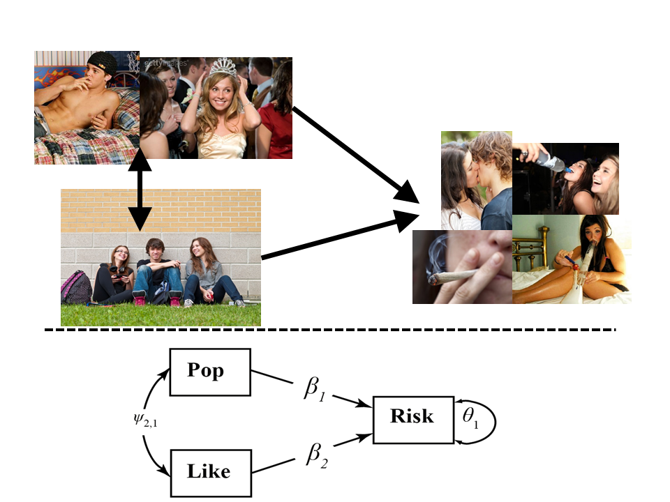
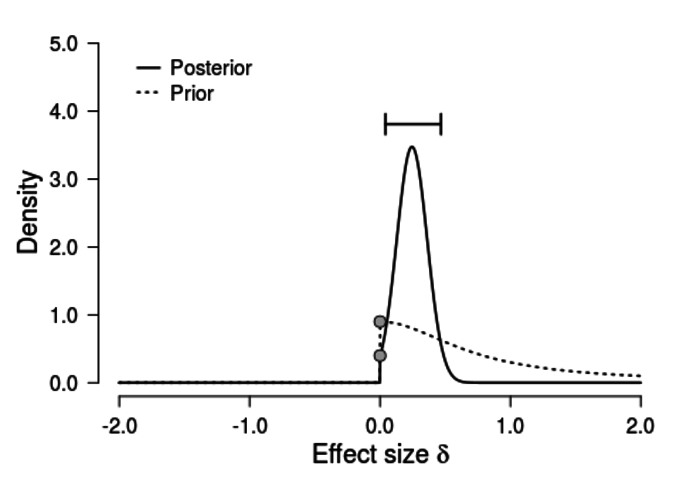

<!--  GENERAL REMARKS:
      - I changed the order of the five death acts of the p-value; this is jsut a suggestion
        I think that it would fit nicely ti bring the H0 and H1-related acts after each other,
        culminating in the fact that theyanswer the wrong question;
        therefore, I moved the optional stopping to be the second act
        - I marked each slide with the name of who I think should present it.
          You'll notice two things:
          First, you present much more than me. This has the reason that I think when one person
          presents more than the other it is nicer, but also I think that all topics I marked wit hyour name
          just fit you so well :D I think you could talk great about everything I marked with your name.
          Second, in my suggestionas it is now, I'd have three short parts. This might seem strange since we switch
          quite "often" but from my experience, all short workshops I've seen so far
          that were given by two people, it turned out to be especially nice when they switched;
          it just relaxes the atmosphere. Also, thrice is not so often I think...
-->

<!-- I'd not show but rather say these things while presenting the title slide

## Attend at your own peril
- you will hear things you probably have never heard before ...
- ... and neither has your statistics teacher or thesis advisor
- all this will be **heavy** statistical re-education
- you will be a different person after this workshop
- but trust us, it will be awesome

-->

## Outline <!-- Fabian -->

<!--  Comment on the outline:
      The sub-points are not important to short or mention here,
      they just provide a structure for ourselves
--> 

- Statistics: The Status Quo
    * 1.1 A Bird's View
    * 1.2 An Example
    * 1.3 The History
    * 1.4 Frequentist inference, bootstrapped
- p-Values: A Death in Five Acts
    * 2.1 Sampling: Hidden subjectivity
    * 2.2 Sampling: When to stop?
    * 2.3 Inference: Statistical Evidence
    * 2.4 Inference: There is no free lunch
    * 2.5 Inference: Answer the wrong question
    
## Outline
    
- Confidence Intervals and Statistical Power
    * 3.1 ES and CI: A Solution?
    * 3.2 A Power fallacy
    
- Intermediate Step
    * 4.1 Likelihood Ratios, with demo
    
- An elegant extension: Bayesian Inference
    * 4.1 Prior distributions
    * 4.2 Bayes factors, with demo
    * 4.3 Credibility Intervals

## Outline

- Issues in Bayesian inference
    * 5.1 Computation
    * 5.2 Priors
    * 5.3 Teach me!
 
- Teach me!
    * 6.1 JASP
    * 6.2 BayesFactor

- Where to go from here?

# The Status Quo in Statistics

## A Bird's View <!-- Fabian -->
  Classical Statistics     Bayesian Statistics
----------------------     ---------------------------
Ad-hoc                     Axiomatic
Incoherent                 Coherent
Paradoxical                Intuitive
Irrational                 Rational
Ugly                       Pretty
Irrelevant                 Relevant
What students are taught   What students are **not** taught

<div id="contrast">borrowed from EJ Wagenmakers</div>
## put succinctly ...
> "The textbooks are wrong. The teaching is wrong. The seminar
> you just attended is wrong. The most prestigious journal in your
> scientific field is wrong.”

> - Ziliak and McCloskey (2008)

## An Example: Risk Behaviour and Social Status <!-- Peter -->

<!--  Show example in R: Research Question:
      Is Risk Behaviour related to Popularity (how popular classs peers rate you)
      and to Likeability (how much class peers like you)
      -> Discuss: What does the p-value tell us?
      -> Is there something strange about it? Yes?
      - in that case, let's explore why we use this stuff!
-->

<div align="center">

</div>

## An Example: Risk Behaviour and Social Status <!-- Peter -->

```{r, eval=FALSE}

setwd("C:/Users/.../bayes_workshop/data") # Set working directory
risk_bayes <- read.csv("riskdata_bayes.csv") # Load data
attach(risk_bayes) # Set data as working file
summary(lm(risksum~ZPop+ZLike)) # Multiple regression

```

<div align="center">

</div>

## An Example: Risk Behaviour and Social Status <!-- Peter -->

- What does *p* tell us?

- *The probability to get data this or more extreme in case that in the underlying population there is no association between popularity/likeability and risk behaviour is less than 0.1%*

- Does this sound *strange* to you?


## History: How did we get Here? <!-- Fabian -->

- R.A. Fisher, only $H_0$, varying $\alpha$, strength of evidence
- Neyman-Pearson, also $H_1$, power, $\beta$, behavioral statistics
- how all this was bastardized and unified [@gigerenzer1993superego]
- how people use it now [@gigerenzer2004mindless; @gigerenzer2014surrogate]

## Ronald Fisher

> "No scientific worker has a fixed level of significance at which from year to year, and in all
> circumstances, he rejects hypotheses; he rather gives his mind to each particular case in the light
> of his evidence and his ideas."

## Neyman-Pearson
> "We are inclined to think that as far
> as a particular hypothesis is concerned, no test based upon the theory
> of probability can by itself provide any valuable evidence of
> the truth or falsehood of that hypothesis. But we may look at the
> purpose of tests from another view-point. **Without hoping to know**
> **whether each separate hypothesis is true or false**, we may search
> for rules to **govern our behaviour** with regard to them, in following
> which we insure that, in the long run of experience, we shall not be too often wrong."

<!--  explain what Fisher meant,
      explain what Neyman/Pearson meant
      explain what "unification" of these means/led to
      explain that how it is used now is called "frequentist statistics"
      so this term is now properly introduced,
      and that this is indeed what they are learning at university!
-->

## what is probability? <!-- Fabian -->
- for frequentists, probability is the long-run average frequency of events
- for example, the probability of a coin coming up heads is the proportion of heads in an **infinite** amount of tosses
- to ask about the probability of the next coin toss being heads is **nonsensical**
- the next coin toss is either heads, or it is not
- single events don't have probability; the proportion of certain outcomes with respect to a reference class do!
- **repeatability** becomes a crucial ingredient
- Fisher: geneticist, worked  in agriculture, did lots of repeatable experiments
- Jeffreys: geophysicist, looked at earthquakes etc., no way of repeating experiments

## what is probability?
- frequentists cannot talk about
 * the probability of a 3rd world war
 * climate change
 * you failing your next exam
 * any non repeatable event
- these issues are about **uncertainty**, and need a Bayesian take on probability
- by conceptualising probability as long-run average frequency, classical statistics deprived itself of answering the essential question in science
- ***what is the probability that my hypothesis / theory is true?***


<!--  explain what frequentists mean with "probability" -> infinite blabla
      explain what the p-value therefore means
      explain that there is confusion about the p-value
      explain that the same confusion surrounds CIs;
      mention that CIs will be explained later
-->

# what is in a p-value? <!-- Fabian -->

## some statements
- suppose you run an experiment testing the effect of some treatment
- you have a control group (n = 20) and a treatment group (n = 20)
- you run an independent t-test and get $t(18) = 2.7, p = 0.01$
- let's rate some statements!

## statement 1
- You have absolutely disproved the null hypothesis of no difference.

## statement 1


## statement 1
- You have absolutely disproved the null hypothesis of no difference.
- everything in statistics is probabilistic, there are no **absolutes**

## statement 2
- You have found the probability of the null hypothesis being true.

## statement 2


## statement 2
- You have found the probability of the null hypothesis being true.
- in classical statistics, you cannot assign probabilities to your hypotheses
- but every researcher really, really, really, really wants that!
- one reason for Bayesian statistics ;)

## statement 3
- You have absolutely proved your experimental hypothesis (there is a difference).

## statement 3


## statement 3
- You have absolutely proved your experimental hypothesis (there is a difference).
- same as statement 1: probabilistic, not absolute!

## statement 4
- You can deduce the probability of the experimental hypothesis being true.

## statement 4


## statement 4
- You can deduce the probability of the experimental hypothesis being true.
- same as statement 2: can't assign probabilities to hypotheses!

## statement 5
- You know, if you decide to reject the null hypothesis, the probability that you are making the wrong decision.

## statement 5


## statement 5
- You know, if you decide to reject the null hypothesis, the probability that you are making the wrong decision.
- ummm, isn't that $\alpha$?
- **classic** NO: $\alpha$ is about an infinite amount of experiments
- in this case, the probability is $1 - p(H_0)$
- cannot get $p(H_0)$ without Bayes, so this statement is wrong


## statement 6
- You have a reliable experimental finding in the sense that, if the experiment were repeated a great number of times, you would obtain a significant result on 99% of occasions.

## statement 6


## statement 6
- You have a reliable experimental finding in the sense that, if the experiment were repeated a great number of times, you would obtain a significant result on 99% of occasions.
- that's the **replication fallacy**

# frequentist inference <!-- Fabian -->

## how a frequentist draws inference
- suppose you are being asked 26 questions about Bayesian statistics ($N = 26$)
- you happen to answer 8 correctly ($k = 8$)
- are you better than guessing?
- test $H_0: \theta = \frac{1}{2}$ against $H_1: \theta \neq \frac{1}{2}$
  
## how a frequentist draws inference
- to obtain the **sampling distribution** assume that $H_0: \theta = \frac{1}{2}$ holds
- imagine that the experiment is repeated very many times under **identical circumstances**
- for each **hypothetical** experiment, calculate the test statistic of the **hypothetical** sample
- the distribution of these test statistics are called the **sampling distribution**

## graphically


## sampling plan
- there are two different ways to conduct the experiment
- either fix $N = 26$ and count the number of correct answers
- or ask so many questions until one gets $k = 8$ correct answers
- first one is binomial, the second one is negative binomial
- $p(k | \theta, N) = \binom{n}{k} \theta^k (1 - \theta)^{n - k}$
- $p(N | \theta, z) = \binom{n - 1}{k - 1} \theta^k (1 - \theta)^{n - k}$

## note
- a frequentist **needs** this sampling distribution
- often, properties of the sampling distribution can be derived analytically from the sample data
- for example, the variance of the **sampling distribution** of the **sample mean** is $\sigma^2 = \frac{s^2}{N}$
- this is one reason why frequentism got so much traction: it is computationally trivial

## bootstrapping
- in order to **see** what happens here, let us simulate a large number of replications of the experiment!
- we will draw independent random samples from our actual observed data, and compute the test statistic of that draw
- in the binomial case, the test statistic is the **number of correct answers**
- in the negative binomial case, the test statistic is the **number of questions**

## binomial bootstrapping
```{r}
binom.boot <- function(dat, samples = 10000) {
    n <- length(dat) # is fixed!
    result <- numeric(samples)

    for (i in 1:samples) {
        draw <- sample(dat, n, replace = TRUE)
        result[i] <- sum(draw)
    }

    result
}
```

## negative binomial bootstrapping
```{r}
nbinom.boot <- function(dat, samples = 10000) {
    k <- sum(dat) # is fixed!
    result <- numeric(samples)

    for (i in 1:samples) {
        ss <- sample(c(0, 1), 1, prob = c(0.5, 0.5))

        while (sum(ss) != k) {
            ss <- c(ss, sample(c(0, 1), 1, prob = c(0.5, 0.5)))
        }

        result[i] <- length(ss)
    }
    result
}
```

## practical difference


## frequentist inference
- assumes that the parameter $\theta$ is fixed
- only the data is allowed to vary
- we can intuit that confidence intervals, statistical power etc. are not properties of the data
- they are properties of the **testing procedure**

# p-values: a death in five acts <!-- Fabian -->
 
<!--  what we as researchers want to do is provide evidence for "our" hypothesis
      coming up, I explain why frequentist statistics and the p-value fail to do that
      you can probably all sense from your statistics class and from what we have discussed so far
      that p-values tell us something strange; now, I will confirm this impression
      by showing you why the p-value is somnething stupid
      -> wouldn't use "NHST" here but rather stick to "the p-value"
      -> unless we really nicely introduce what NHST means;
      -> perhaps using the term "the p-value" is sufficient for our means?
-->

## act I <!-- Fabian -->
- result of statistical analysis depends on the intention of the researcher
- because those intentions define the space of all possible (unobserved) data
- demonstrate on binomial versus negative binomial example
- funny story about grant application [@wagenmakers2008bayesian]
- binomial versus negative binomial sampling plan [@wagenmakers2007practical; @kruschke2010doing]

<!--
  use this later also for Bayesian inference and the likelihood principle
-->

## act II <!-- Fabian -->
- optional stopping [@sanborn2014frequentist; @rouder2014optional]
- use p-hack R code to show inflated alpha

## act II, demo
```{r, message = FALSE, eval = FALSE}
source("http://rynesherman.com/phack.r") # read in the p-hack function

res <- phack(initialN=30, hackrate=5, grp1M=0, grp2M=0, grp1SD=1, grp2SD=1,
   maxN=200, alpha=.05, alternative="two.sided", graph=TRUE, sims=2000)
```

## act II, demo


## act II, implications
- ethical
- money & ressources
- just downright horrible

## act III <!-- Fabian -->
- don't quantify statistical evidence; @wagenmakers2007practical
- $p = 0.04, n = 10$ is more evidence than $p = 0.04, n = 1000$
- in fact, the latter is support for $H_0$!
- are violently biased against $H_0$

## act IV <!-- Fabian -->
- cannot accept $H_0$
- violently biased against $H_0$
- underlying logic of p-values: either the null hypothesis is false, or a rare event has occured

## p-values: flawed reasoning
- the following is logically correct:
- (Premise): If Hypothesis $H$ is true, then event $X$ will not occur.
- (Premise): Event $X$ occured.
- (Conclusion): Hypothesis $H$ is not true.

## p-values: flawed reasoning
- this **does not** translate to probabilistic settings
- (Premise): If Hypothesis $H$ is true, then event $X$ is **unlikely**.
- (Premise): Event $X$ occured.
- (Conclusion): Hypothesis $H$ is **probably not true**.

## p-values: flawed reasoning
- take this example as demonstration:
- (Premise): If Jane is an American, then it will be unlikely that she is a U. S. Congressperson.
- (Premise): Jane is a U. S. Congressperson.
- (Conclusion): Jane is probably not an American.
- by only looking at $p(D|H_0)$, p-values are violently biased against $H_0$

## the case of Sally Clark
- both Clark's babies died, where $p(\text{baby dies}) = \frac{1}{8543}$
- thus the probability that both babies died is roughly 1 in 73 million
- since this is soo incredibly low ($p < 0.00001$ or whatnot), Clark **probably killed** her babies
- indeed, in November 1999, a jury found poor Sally guilty of double murder

## what the hell just happened?

## the case of Sally Clark
> "The jury needs to weigh up two competing explanations for the babies’ deaths: SIDS or murder. The fact that two deaths by SIDS is
> quite unlikely is, taken alone, of little value. Two deaths by murder may well be even
> more unlikely. What matters is the relative likelihood of the deaths under each
> explanation, not just how unlikely they are under one explanation."

- **President of the Royal Statistical Society** (2002)

## the case of Sally Clark
- in fact, $p(\text{baby dies} | \text{sudden infant death})$ is higher than $p(\text{baby dies} | \text{murder})$
- the ratio of these two - the **likelihood ratio** - is the proper measure of statistical evidence
- statistical evidence is **always** relative; there is **no free lunch**

## Berkson (1938)
> “My view is that there is never any valid reason for rejection of the null hypothesis except on the
> willingness to embrace an alternative one. No matter how rare an experience is under a
> null hypothesis, this does not warrant logically, and in practice we do not allow it, to reject
> the null hypothesis if, for any reasons, no alternative hypothesis is credible.”
- free lunch [@rouder2009bayesian; @rouder2014lunch]
- can't support $H_0$

## act V <!-- Fabian -->
- answer the wrong question, p(H|D), p(D|H)
- make it clear that we want p($H_0$|D); shark example from Dienes


# Effect Sizes and Confidence Intervals: The *Frequentist* Solution?

## ES & CI <!-- Peter -->
- @Cumming2014psychscience

## Sorry, **No** Solution <!-- Peter -->
- @Morey2014essential
- @morey2015fallacy

<!--  Peter explains what ES and CI are
      and why Cumming thinks they are the solution
      to the p-value problems
      then, Peter explains the problems with interpretations of CIs
      and the Morey et al argument about hypothesis testing
      In addition, there are other problems here,
      that Fabian discusses...
      
      PETER! Maybe do the same I do with the p-value?
      The Hoekstra et al. (2014) paper about the confusions?
      We can ask the students !!
-->


## Power <!-- Fabian -->
- briefly mention @ioannidis2005most and @button2013power
- a power fallacy [@wagenmakers2014power]
- via Bayes's Rule, we can show that $\frac{1 - \beta}{\alpha}$ is the statistical evidence of $p < \alpha$
- thus, on average, high powered experiments yield informative data
- but when the data are in, we can't rely on power anymore
- "Power is a pre-experimental concept that averages over all possible outcomes of an experiment, only one of which is actually observed."
- urn drawing example from @wagenmakers2014power

## recap
- p-values are subjective
- p-values are biased against $H_0$
- p-values don't quantify statistical evidence
- p-values address the wrong question
- statistical power, as well as confidence intervals, average over all possible, but unobserved data
- inference based on p-values cannot support $H_0$ [@wagenmakers2015absence]
- but invariances are of theoretical importance [@rouder2009bayesian]!

# Likelihoods

## likelihoods
- in conditional probability, say $p(D|H)$, the hypothesis is fixed and the data vary
- in likelihoods, $L(H|D)$, the data is fixed and the hypothesis varies
- $L(H|D) \propto K \times p(D|H)$, need not sum to one
- **law of likelihood**: data supports $H_0$ **over** $H_1$ iff $p(D|H_0) > p(D|H_1)$
- **likelihood principle**: all information relevant for statistical evidence is contained in the likelihood function
- for both the binomial and the negative binomial case, the likelihood is $\theta^k (1 - \theta)^{n-k}$

## likelihood function
- is just the likelihood, $L(\theta|D)$, plotted for every value of $\theta$
- Shiny demo!

## likelihood ratios
- make terrible sense, right?
- however, we often don't know the point value of the alternative (true effect size)
- we can quantify our uncertainty with a **prior probability distribution**
- write stuff on the pinboard

<!--
here I can basically introduce everything! I will start with a binomial example, about answering questions
correctly in a quizz (this is the example I use when introducing frequentist inference above; in the bootstrap example).
That parameters have a distribution; that the data is fixed. In frequentism, this is reversed. Thus one can easily see why confidence intervals
and the like cannot speak about the specific data set.

I will show that Bayes only uses likelihoods, thereof the sampling plan (binomial vs. negative binomial) does not matter.
First I will write down $\frac{p(H_0|\theta)}{p(H_1|\theta)} = \frac{p(\theta|H_0)}{p(\theta|H_1)} \times \frac{p(H_0)}{p(H_1)}$
as the fundamental equation; even frequentists agree. The second term, the likelihood ratio, quantifies the statistical evidence; it's the
amount we should update our prior beliefs given the data. Likelihoodists no compute the likelihood ratio, say the probability of the data given
$\theta = \frac{1}{2}$ versus $\theta = \frac{3}{4}$. We will see that there is a problem, since we are uncertain about the alternative, composite hypothesis;
the null hypothesis of guessing is clear, though. So we assume a distribution over the alternative, say a uniform or Cauchy distribution. I will demonstrate here
that the huge problem was that those "diffuse" priors are not invariant of transformations. I will mention Harold Jeffreys.

Now we see that there are two priors! One over the parameter, and one over the models (expressed in the prior odds). This is crucial. This, then, basically is
Bayesian inference. I will show that although ESP skeptics and non-skeptics will disagree over the prior odds, they will not disagree over the Bayesian likelihood
ratio, the Bayes factor. This is vital. I will then compute this. I will show that when the parameter is not bounded to [0, 1], using diffuse priors is a bad idea,
since it leads to unbounded support for $H_0$ - the Jeffreys-Lindley paradox.

This whole thing is the crucial argument!!
-->

# Bayesian Inference <!-- Fabian -->

## prior distributions
- familiar equation: $\frac{p(H_0|D)}{p(H_1|D)} = \frac{p(D|H_0)}{p(D|H_1)} \times \frac{p(H_0)}{p(H_1)}$
- in words: $\text{posterior odds} = \text{Bayes factor} \times {\text{prior odds}}$
- problem: cannot test composite hypothesis with likelihood ratios
- want to quantify my uncertainty over the range of possible alternative values with a prior distribution
- important distinction: prior on parameters, prior on models

## prior distributions
- in the **early** days with little computing power, **conjugate** priors were used
- these are priors where the  **posterior** distribution is in the same family as the **prior** distribution
- a conjugate prior for the binomial case is the **Beta distribution**

## Beta distribution
- [demo!](http://87.106.45.173:3838/felix/BayesLessons/BayesianLesson1.Rmd)


## deriving Bayes Rule <!-- Fabian -->
- use a funny example; maybe ESP

## Bayes factors <!-- Fabian -->
- computationally hard
- Savage-Dickey! [@wagenmakers2010bayesian]


## Credibility Intervals <!-- Fabian -->
- Explain what they tell
- short note on estimation versus testing [@morey2014hypothesis]

## solutions <!-- Fabian -->
- show that all frequentist problems vanish
- conceptualize probability as degree of belief
- parameters have distributions
- intentions: likelihood (binom vs negbinom)
- optional stopping: b-hack code (?)
- multiple comparisons: b-hack code (?)
- power and evidence for $H_0$: @wagenmakers2015absence
- bias against $H_0$: re-analysis of literature [@wetzels2011statistical]


## *Why aren't we all Bayesians - Can you Teach me?* <!-- Peter -->
- "Why can't we all just be Bayesian?" (Lee, [here](https://webfiles.uci.edu/mdlee/Lee2014_NewStatistics.pdf))
- we can now!
- Computation
- Priors
- Software

<!--  Peter explains issues with computational power,
      subjectivity of priors, (perhaps Lindley's paradox)
      and software for implementation,
      mitigating all arguments and leading over to Fabian and JASP
-->

<!-- UNTIL HERE WE SHOULD HAVE ABOUT 1h15 minutes! => I think we can do this! The first part will be a little dry,
but I think the concepts are important :)
--> 

# Teach me!

## JASP <!-- Fabian -->
- various data sets
- I would like to have 30 minutes for this part

## BayesFactor <!-- Fabian -->
- for the R people
- briefly demo-ing it, depending on the audience

# Wrap up <!-- Fabian -->

# We should all just be Bayesian <!-- Fabian -->
<!--  "In 20 years, our children will ask us
      why we've ever been frequentist,
      and the answer will be difficult"
-->

## References